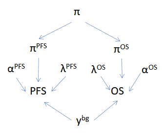
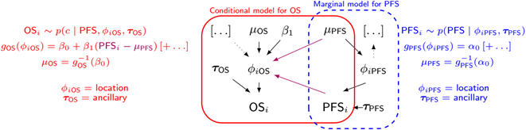
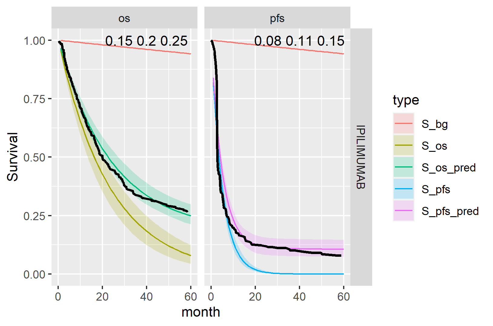
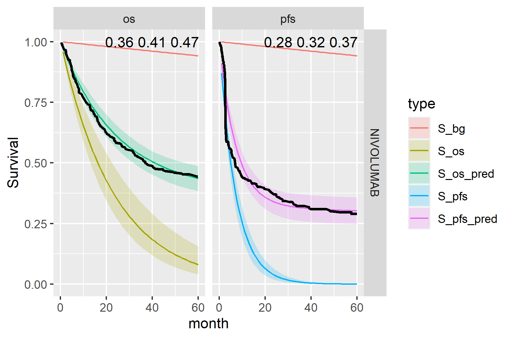
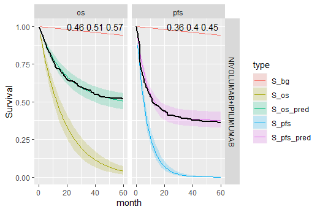
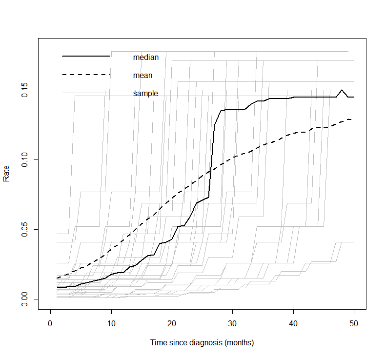

```{r, include = FALSE}
knitr::opts_chunk$set(
  collapse = TRUE,
  comment = "#>"
)
```

### Executive summary

In this project we formulate and demonstrate the application of a
Bayesian mixture cure model (MCM) using the Checkmate 067 study dataset
and the Exponential distribution for event times. Analogous results to
those created previously for the frequentist MCM approach are produced
and we extend the Bayesian MCM to incorporate additional structure,
including the joint (bivariate) modelling of overall survival (OS) and
progression-free survival (PFS) event times. We show that the separate
Exponential OS and PFS Bayesian MCMs perform well for the Checkmate 067
data. The jointly distributed event time Bayesian MCM also has good
predictive performance. The real benefit of this approach may be with
other dataset where there is short follow-up or small sample sizes. The
associated R code for this work, held in a private on-line repository,
has been written for re-use and generalisability to other problems.
Areas for future work are given.

## Background

Immuno-oncologic (IO) studies for melanoma therapies, such as
*ipilimumab* (`ipi`), *nivolumab* (`nivo`), and the *nivolumab* with
*ipilimumab* (`nivo + ipi`) combination, have indicated that survival
curves "plateau" (a considerable proportion of patients are "long-term
survivors"). Cure models are a special type of survival analysis where
this "cure fraction" (the underlying proportion of responders to
treatment/long-term survivors) is accounted for. Cure models estimate
the cure fraction, in addition to a parametric survival function for
patients that are not cured. The mortality risk in the cured patients is
informed by a background mortality rate. The population that is not
cured is subject both to background mortality and to additional
mortality from their cancer, estimated using a parametric survival
model.

A mixture cure model (MCM) (@Amico2018) is a type of cure model where
survival is modelled as a mixture of two groups of patients: those who
are cured and those who are not (and who therefore remain at risk). The
survival for a population with a cure fraction can be written as
follows:

```{=tex}
\begin{align}
\tag{*}
S(t, x) = S^*(t, x)[\pi(x) + (1 − \pi(x))S_u(t, x)],
\end{align}
```
where $S(t, x)$ denotes the survival at time $t$, $S^*(t, x)$ denotes
the background mortality at time $t$ conditional on covariates $x$,
$\pi(x)$ denotes the probability of being cured conditional on
covariates $x$, and $S_u(t, x)$ denotes the event (progression or
mortality) due to cancer at time $t$ conditional on covariates $x$. For
PFS, the survival is composed of either progressing to a disease state
or death.

## Aims

The aims of the the analysis in this document are as follows:

-   Demonstrate the application of a Bayesian mixture cure model using
    the Checkmate 067 study dataset and the Exponential distribution for
    event times.
-   Produce analogous results to those created previously for the
    frequentist approach.
-   Extend the Bayesian model to incorporate additional structure,
    including the joint bivariate modelling of OS and PFS event times.

This analysis has been carried-out using the Stan inference engine
(@carpenter2017stan) called from R on a Windows PC. The packaged code
can be downloaded from a private GitHub repository with permission from
the package authors at
<https://github.com/StatisticsHealthEconomics/rstanbmcm>. See the *How
to use rstanbmcm* vignette for an introduction to how to use the
package.

## Likelihood

Let $T_i$ be the non-negative random variable denoting the survival time
of patient $i$ with covariate vector $\boldsymbol{x}_i$.

In the simplest case we can assume that the cure fraction is the same
for the whole population i.e. $\pi$ is fixed. Further, we can assume the
$\pi$ models the relationship between $\boldsymbol{x}_i$ and the
probability of being cured. E.g. using a logistic-linear model

$$
\pi(\boldsymbol{x}_i | \boldsymbol{\beta}) = 1/[1 + \exp(-\boldsymbol{x}_i^T \boldsymbol{\beta})].
$$

The likelihood of the standard survival is

$$
L = \prod_i S(t_i | \boldsymbol{x}_i) h(t_i | \boldsymbol{x}_i)^{\delta_i}
$$

Log-likelihood is therefore $$
\mathcal{l} = \sum_i \log(S(t_i | \boldsymbol{x}_i)) + \delta_i \log(h(t_i | \boldsymbol{x}_i))
$$

Plugging this directly into the mixture cure equation in (\*) gives

$$
\mathcal{l}(\pi | \boldsymbol{\delta}, \boldsymbol{x}) =
 \sum_i \log(S^*(t_i | \boldsymbol{x}_i) h^*(t_i | \boldsymbol{x}_i)^{\delta_i}[\pi(x) +
   (1 − \pi(x)) S_u(t_i | \boldsymbol{x}_i) h_u(t_i | \boldsymbol{x}_i)^{\delta_i}])
$$

We will assume that the cured component is the exponential survival
model. The non-cured component can be thought of in similar terms to the
cumulative incidence function. That is, the probability of an event is
the combined probability of surviving both events (e.g. for OS,
all-cause and cancer mortality) and then experiencing either i.e.
dropping the $S$ dependencies for brevity

```{=tex}
\begin{equation}
\tag{**}
S^* S_u (h^*)^{\delta} + S^* S_u (h_u)^{\delta} = S^* S_u (h^* + h_u)^{\delta}
\end{equation}
```
## Bayesian formulation

In a Bayesian approach to modelling, all quantities that are subject to
uncertainty are modelled using probability distributions. This applies
to observed data (e.g. time to PFS for a given individual), that are
subject to sampling variability, as well as to unobservable parameters
(e.g. the coefficient quantifying the impact of age or sex over the
average survival curve). In this latter case, probability distributions
are used to model the epistemic uncertainty (e.g. the fact that we do
not know for certain what the "true" underlying value of the model
parameter is). In addition, we may model as yet unobserved (but
potentially observable) quantities using a suitable probability model.
For example, we could consider the extrapolated part of the survival
curve as subject to uncertainty due to the current sampling process
giving rise to the data that are actually observed, as well as the
uncertainty on the underlying data generating process.

We can mix different sources of evidence to form our "prior"
distributions, which are used to describe the state of science on the
model parameters. These are then combined with any observed data to form
an updated level of knowledge. This process is particularly relevant in
the case at hand, when data can only inform about limited aspects of the
overall underlying reality. For this reason, it is important to a)
include information/evidence available in the form of external data
and/or expert opinion; b) extract the most information possible from the
available data (e.g. by formally trying to model the correlation between
the PFS and the OS data to borrow strength from the more mature set of
observations).

A built-in advantage of the Bayesian procedure is that uncertainty is
directly and formally propagated to an economic model; the main output
from the statistical analysis (the extrapolated survival curve) are
produced by default as based on a full posterior distribution. From
this, we can easily derive a "base case" (e.g. taking the mean value)
but without the need for further tools (such as bootstrap) we already
have a full characterisation of the underlying uncertainty that can be
used in the process of probabilistic sensitivity analysis. We can
moreover add information in the priors to ensure that the extrapolation
beyond the observed data is realistic and consistent with the clinical
expertise (e.g. by "anchoring" the extrapolated survival curve to be
probabilistically below the curves for the healthy population, or by
ensuring that OS behaves in a way to respect some agreed level of
similarity, or correlation, to PFS).

#### Posterior equation

Using the likelihood function defined above and prior distributions on
uncertain parameters, we can specify the posterior distribution.
Defining $g_2$ as the prior distribution for the coefficients of the
uncured fraction $\beta^u$ and $g_3$ as the prior distribution for the
coefficients of the cured fraction $\beta^*$, then the general form of
the posterior distribution can be written as follows.

$$
p(\pi, \boldsymbol{\beta^u}, \boldsymbol{\beta^*} | \boldsymbol{\delta}, \boldsymbol{x}) \propto
L(\pi, \boldsymbol{\beta^u}, \boldsymbol{\beta^*} | \boldsymbol{\delta}, \boldsymbol{x}) f(\pi) g_2(\boldsymbol{\beta^u}) g_3(\boldsymbol{\beta^*})
$$

assuming that the cure fraction is independent of the covariates.

### Cure fraction

There are two obvious ways to represent the uncertainty about the cure
fraction in the model.

The first is to specify the cure fraction directly using a
$\pi \sim Beta(a_{cf}, b_{cf})$ prior, most uninformative as a uniform
$Beta(1,1)$. The parameters can be obtained via transformation of mean
and standard deviation to allow a more natural scale for elicitation.

Alternatively, we may specify the uncertainty on the real line with a
Normal distribution and then transform to the probability scale.

A further consideration is how to represent the cure fraction so to
share information between the OS and PFS data. We will investigate 3
alternatives.

-   *Pooled*: Assume that the cure fraction is the same for OS and PFS
    i.e. $\pi_{os} = \pi_{os} = \pi$ where $$
    logit(\pi) \sim N(\mu_{cf}, \sigma_{cf}^2), \;\;
    $$
-   *Separate*: Model each independently. $$
    logit(\pi_{os}) \sim N(\mu_{cfos}, \sigma_{cfos}^2), \;\;  
    logit(\pi_{pfs}) \sim N(\mu_{cfpfs}, \sigma_{cfpfs}^2)  
    $$
-   *Hierarchical*: Assume exchangeability between OS and PFS$$
    \pi \sim N(\mu_{cf}, \sigma_{cf}^2), \;\;  
    logit(\pi_{os}) \sim N(\pi, \sigma_{cfos}^2), \;\;  
    logit(\pi_{pfs}) \sim N(\pi, \sigma_{cfpfs}^2)  
    $$

Below is an example DAG for the hierarchical cure fraction without a joint
time to event component.
Notice that even without the direct relationship between PFS and OS there
is still an indirect influence via $\pi$.

```{r, echo=FALSE, fig.align='center', out.width="40%"}

```


## Exponentially distributed event times

Consider the straightforward case where both the background and cancer
times to event follow Exponential distributions.

Define $f(t)$ density, $S(t)$ survival and $h(t)$ hazard functions.

$$
f(t) = \lambda \exp(-\lambda t), \;\; S(t) = \exp(-\lambda t), \;\; h(t) = \lambda
$$

Which gives the likelihood

$$
\mathcal{l}(\pi | \boldsymbol{\delta}, \boldsymbol{x}) =
 \sum_i \log(\exp(-\lambda^* t) \lambda^{* \delta_i}[\pi(x) +
   (1 − \pi(x)) \exp(-\lambda_u t) \lambda_u^{\delta_i}])
$$

Substituting $S(t)$ and $h(t)$ into (\*\*)

$$
f^*_u = e^{-\lambda^* t} e^{-\lambda_u t} (\lambda^* + \lambda_u)^{\delta} \;\;\; i.e. \mbox{for no censoring} \;\; T \sim Exp(\lambda^* + \lambda_u)
$$

## Background survival

The frequentist analysis used the World Health Organization (WHO) life
tables by country for the latest year available of 2016 (@wholifetables)
to inform the background mortality rate (baseline hazard). These
baseline hazards are the expected mortality rate for each patient at the
age at which they experience the event. The mortality data are age- and
gender adjusted, thus providing a granular account of the different
patient profiles in the trial. The WHO reports conditional probabilities
of death in 5-year intervals until age 85. A constant annual mortality
rate is reported for individuals over 85. They assumed that the maximum
age is 100 years.

In a Bayesian analysis there are alternative ways in which we could
model the background mortality.

#### Use WHO hazard point estimates as known

We could consider the WHO estimates to provide sufficiently accurate
estimates given the sample size and so incorporating uncertainty is not
necessary.

#### Survival distribution informed by the WHO data

However, we also want the developed model to be able to be applied to
other data sets which may be smaller or noisy. Also the mortality rate
for the cured study population may not be the same as the general
population. Sensible prior parameter values can be taken for the life
table hazard curve. After infancy the log-hazard is approximately linear
and so intercept and slope estimates are simple to obtain.

In this analysis we use the more general distributional approach. This
allows for more freedom in the model fitting.

## Jointly distributed event times model

One effective way of modelling joint (bivariate) distributions is to
factorise them into a marginal and a conditional distribution (which
holds as a fundamental rule of probability). In general terms, we can
then write $p(x,y) = p(x)p(y | x)$. In the context of our model, we can
use this intuition to model the joint distribution of the PFS and OS
observed times (in terms of their survival curves) as: $$
S(t_{OS},t_{PFS}) = P⁡(T_{OS} \geq t_{OS}, T_{PFS} \geq t_{PFS})
= S_{PFS} (t_{PFS}) S_{OS|PFS}(t_{OS}│T_{PFS} = t_{PFS}).
$$ The structure above implies that essentially we first create a
marginal generalised linear regression to model the survival curve for
the PFS data (as a function of relevant covariates); the second module
of the model implies another generalised linear regression for the OS
data, where the observed PFS data act as a covariate (in addition to
other relevant predictors, which may or may not be the same used for the
PFS model). Alternative specifications are possible (for instance, the
generalised linear model can be applied on the scale of the hazard
function, if more appropriate). This modelling approach can be
visualised in the graph below.

{width="80%"}

If we factorise into marginal and conditional components to model the
underlying bivariate distribution this can be written generally as

$$
OS_i \sim p(c | PFS, \phi_{iOS}, \tau_{OS})
$$ $$
g_{OS}(\phi_{iOS}) = \beta_0 + \beta_1 (PFS_i - \mu_{PFS})[+ \ldots]
$$ $$
\mu_{OS} = g_{OS}^{-1}(\beta_0)
$$ $$
g_{PFS}(\phi_{iPFS}) = \alpha_0 [+ \ldots]
$$ $$
PFS_i \sim p(PFS | \phi_{iPFS}, \tau_{PFS})
$$ $$
\mu_{PFS} = g_{PFS}^{-1}(\alpha_0)
$$

The combined log-likelihood is $$
\mathcal{l} = \mathcal{l}_{OS} + \mathcal{l}_{PFS}
$$

For the case with exponential OS times and exponential PFS times with
centred age this gives the following.

$$
t_{iOS} \sim Exp(\phi_{iOS})
$$ $$
\log(\phi_{iOS}) = \beta_0 + \beta_1 (t_{iPFS} - \bar{t}_{PFS}) + \beta_2 age_{iPFS}
$$ $$
\mu_{OS} = \exp(\beta_0)
$$ $$
\log(\phi_{iPFS}) = \alpha_0 + \alpha_1 age_{iOS}
$$ $$
t_{iPFS} \sim Exp(\phi_{iPFS})
$$ $$
\mu_{PFS} = \exp(\alpha_0)
$$ $$
\bar{t}_{PFS} = 1/\mu_{PFS} 
$$

Where $\bar{t}_{PFS}$ is the mean time to event for PFS. This is simple
to calculate for the Exponential distribution but is more complicated
for other survival distributions. The parameters $\phi_{iOS}$ and
$\phi_{iPFS}$ are the uncured hazard rates for individual $i$ for OS and
PFS, respectively.

The background hazard rates are specified as follows

$$
t_{iOS} \sim Exp(\phi^*_{iOS})
$$ $$
\log(\phi^*_{iOS}) = \beta_0^* + \beta^*_1 age_{iOS}
$$ $$
t_{iPFS} \sim Exp(\phi^*_{iPFS})
$$ $$
\log(\phi^*_{iPFS}) = \beta_0^* + \beta^*_1 age_{iPFS}
$$ Notice that the coefficients $\beta_0^*$ and $\beta^*_1$ are the same
in both equations .

## Results

We fit the exponential hazard model to the study data and produced the
posterior survival curves below.

For each model and treatment we produce two figures:

1.  The expected survival curves with 95% Credible Intervals (CrI). The
    OS curves are to the left-hand side and PFS curves to the right-hand
    side. Background mortality (i.e. cured patients) is indicated by the
    red line. Non-cured patients survival curves are shown in dark green
    and blue for OS and PFS respectively. Light green and magenta are
    the total sample. The black line is the Kaplan-Meier curve for the
    observed data. Note that these plots are for an average individual,
    e.g. at average age, and so we would not expect them to perfectly
    match the sample data Kaplan-Meier.

2.  Kaplan-Meier curves for 50 simulated trials using the posterior
    prediction distribution for time to event. This is a good model
    checking plot, indicating if we can replicate data similar to the
    observed data using the fitted model.

For the Checkmate dataset we found that the hierarchical model gave
equivalent results to the separate cure fraction model and so for speed
of computation and simplicity we only show the separate cure fraction
results here.

### Independent PFS and OS event times, distributional background

#### Pooled cure fraction

This is the most restrictive model and so as we would expect it gives
the worse results. The OS appears better than the PFS plots; the PFS
CrIs fail to contain the observed data.

```{r fig.show='hold',fig.align='center', out.width="40%", echo=FALSE}
knitr::include_graphics(c("../plots/S_plots_exp_exp_cf_pooled_IPI.png", "../plots/post_pred_cf pooled_exp_exp_IPILIMUMAB.png"))
```

```{r fig.show='hold',fig.align='center', out.width="40%", echo=FALSE}
knitr::include_graphics(c("../plots/S_plots_exp_exp_cf_pooled_NIVO.png", "../plots/post_pred_cf pooled_exp_exp_NIVOLUMAB.png"))
```

```{r fig.show='hold',fig.align='center', out.width="40%", echo=FALSE}
knitr::include_graphics(c("../plots/S_plots_exp_exp_cf_pooled_NIVO+IPI.png", "../plots/post_pred_cf pooled_exp_exp_NIVOLUMAB+IPILIMUMAB.png"))
```

#### Separate cure fraction

The models with independently fit cure fraction appear to fit reasonably
well. The mismatch in fit is due to the assumption of an exponential
survival curve for uncured patients which does not capture the true
curvature.

```{r fig.show='hold',fig.align='center', out.width="40%", echo=FALSE}
knitr::include_graphics(c("../plots/S_plots_exp_exp_cf_separate_IPI.png", "../plots/post_pred_cfsep_exp_exp_IPILIMUMAB.png"))
```

```{r fig.show='hold',fig.align='center', out.width="40%", echo=FALSE}
knitr::include_graphics(c("../plots/S_plots_exp_exp_cf_separate_NIVO.png", "../plots/post_pred_cfsep_exp_exp_NIVOLUMAB.png"))
```

```{r fig.show='hold',fig.align='center', out.width="40%", echo=FALSE}
knitr::include_graphics(c("../plots/S_plots_exp_exp_cf_separate_NIVO+IPI.png", "../plots/post_pred_cfsep_exp_exp_NIVOLUMAB+IPILIMUMAB.png"))
```

### Jointly distributed PFS and OS event times, distributional background

We see that the expected OS survival curves are biased; over-estimating
the rate. This is not the case for the *ipilimumab*. This is due to the
additional joint component in the OS linear regression. This may be due
to censoring since *ipilimumab* has the smallest amount. This is an area
for research.

However, the model does fit well taking in to account the case-mix of
the study population. The posterior prediction plots show that the
Kaplan-Meier for the observed data lies within the simulated curves.

```{r fig.show='hold',fig.align='center', out.width="40%", echo=FALSE}
knitr::include_graphics(c("../plots/S_plots_exp_exp_cf_separate_IPI_joint.png", "../plots/post_pred_joint_cf separate_exp_exp_IPILIMUMAB.png"))
```

```{r fig.show='hold', fig.align='center', out.width="40%", echo=FALSE}
knitr::include_graphics(c("../plots/S_plots_exp_exp_cf_separate_NIVO_joint.png",
                          "../plots/post_pred_joint_cf separate_exp_exp_NIVOLUMAB.png"))
```

```{r fig.show='hold',fig.align='center', out.width="40%", echo=FALSE}
knitr::include_graphics(c("../plots/S_plots_exp_exp_cf_separate_NIVO+IPI_joint.png", "../plots/post_pred_joint_cf separate_exp_exp_NIVOLUMAB+IPILIMUMAB.png"))
```

The table below summarises the cure fraction posterior distribution for
each scenario.

| | Event times | Cure fraction | Treatment | $cf_{OS}$ (CrI)   | $cf_{PFS}$ (CrI)  | $\beta_{joint}$ (CrI)  |
|-|------------:|--------------:|----------:|------------------:|------------------:|-----------------------:|
|1| Independent | Pooled        | IPI       | 0.14 (0.12, 0.18) | 0.14 (0.12, 0.18) |                        |
|2| Independent | Pooled        | NIVO      | 0.36 (0.33, 0.41) | 0.36 (0.33, 0.41) |                        |
|3| Independent | Pooled        | NIVO+IPI  | 0.44 (0.4, 0.48)  | 0.44 (0.4, 0.48)  |                        |
|4| Independent | Separate      | IPI       | 0.27 (0.19, 0.38) | 0.14 (0.1, 0.18)  |                        |
|5| Independent | Separate      | NIVO      | 0.42 (0.37, 0.47) | 0.32 (0.27, 0.36) |                        |
|6| Independent | Separate      | NIVO+IPI  | 0.5 (0.45, 0.55)  | 0.38 (0.33, 0.43) |                        |
|7| Joint       | Separate      | IPI       | 0.18 (0.12, 0.24) | 0.14 (0.11, 0.19) | -0.286 (-0.489, -0.155)|
|8| Joint       | Separate      | NIVO      | 0.16 (0.1, 0.2)   | 0.31 (0.26, 0.36) | -0.125 (-0.17, -0.094) |
|9| Joint       | Separate      | NIVO+IPI  | 0.22 (0.17, 0.27) | 0.38 (0.33, 0.43) | -0.145 (-0.212, -0.099)|


Leave-one-out cross validation


|Model |Statistic | Estimate | SE  |
|-----:|---------:|---------:|----:|
|   4  | elpd_loo | -1834.3  | 35.6|
|   5  |          | -1666.8  | 46.2|
|   6  |          | -1538.5  | 54.3|
|   4  | p_loo    | 7.1      | 0.8 |
|   5  |          | 8.4      | 0.8 |
|   6  |          | 9.6      | 1.4 |
|   4  | looic    | 3668.6   | 71.2|
|   5  |          | 3333.6   | 92.4|
|   6  |          | 3077.1   |108.6|


### Hierarchical cure fraction, fixed (known) background

```{r fig.show='hold',fig.align='center', out.width="40%", echo=FALSE}

```

```{r fig.show='hold',fig.align='center', out.width="40%", echo=FALSE}

```

```{r fig.show='hold',fig.align='center', out.width="40%", echo=FALSE}

```

The table below summarises the cure fraction posterior distribution for
each scenario.

| | Event times | Cure fraction | Treatment | $cf$ (CrI)          | $cf_{OS}$ (CrI)     | $cf_{PFS}$ (CrI)    |
|-|------------:|--------------:|----------:|--------------------:|--------------------:|--------------------:|
|1| Independent | Hierarchical  | IPI       |0.151 (0.068, 0.26)  |0.196 (0.136, 0.255) |0.112 (0.079, 0.155) |
|2| Independent | Hierarchical  | NIVO      |0.378 (0.216, 0.557) |0.412 (0.35, 0.479)  |0.321 (0.262, 0.379) |
|3| Independent | Hierarchical  | NIVO+IPI  |0.463 (0.322, 0.62)  |0.519 (0.448, 0.585) |0.398 (0.336, 0.455) |


Leave-one-out cross validation statistics:

|         |stat      |     Estimate|          SE|
|--------:|---------:|------------:|-----------:|
|IPI      |elpd_waic | -1838.826318|  36.0674047|
|NIVO     |elpd_waic | -1679.593315|  45.6855459|
|IPI+NIVO |elpd_waic | -1543.235582|  53.8029923|
|IPI      |p_waic    |     5.373491|   0.4815243|
|NIVO     |p_waic    |     7.452234|   0.6225800|
|IPI+NIVO |p_waic    |     6.671215|   0.5213592|
|IPI      |waic      |  3677.652636|  72.1348094|
|NIVO     |waic      |  3359.186630|  91.3710918|
|IPI+NIVO |waic      |  3086.471164| 107.6059845|


The variance partition coefficient (VPC) is defined as $\sigma_{global}^2/ (\sigma_{global}^2 + \sigma_{e}^2)$ where $e = PFS$ or $OS$.

|         |       PFS|        OS|
|--------:|---------:|---------:|
|IPI      | 0.8132749| 0.7838815|
|NIVO     | 0.8760108| 0.8765306|
|IPI+NIVO | 0.8571695| 0.8459290|


## Future work

#### Expand available distributions

Having shown the application of these methods to this problem we will
extend the tool kit to include other standard parametric distributions
are tested:

-   Weibull
-   Gompertz
-   Log-normal
-   Log-logistic
-   Generalised gamma

#### Sensitivity analysis

Of course, when the data offer only limited amount of information, the
assumptions in the prior distribution possibly exert much influence on
the results - and crucially on the decision model output. We will
conduct extensive sensitivity analysis and will justify assumptions in
all aspects of the modelling strategy by assessing the meaning of the
various distributional assumptions visually and formally.

#### Model checking and testing

We have already written a suite of simulation functions to create
synthetic cohorts with which to test the models such that we know the
true underlying data generating process.

#### Background survival

An alternative non-parametric approach, as used in @Demiris2006, is to
use a *Gamma process* to define gamma distributions at each time. A
variance parameter determines the influence between times.

Average values derived from the life tables are used in the Gamma
process. These are age-sex-country standardised. The below plot shows
the mean, median and a sample of hazard curves for the checkmate data
set. The underlying hazard curve for 0-100 year olds is shifted left
depending on the starting age of an individual in the cohort.

```{r, echo=FALSE, fig.align='center', out.width="60%"}

```

#### Additional model structure

The two regression models can be extended to more complex structures,
for instance by including a mixture model in one or both (and eventually
by including some further correlation structure in the mixing
parameters).

For this analysis it was unnecessary but we may generalise the model so
that the cure fraction is dependent on covariates. Therefore, the
posterior with $\beta^{cf}$ representing the coefficients of the cure
fraction regression is

$$
p(\boldsymbol{\beta^u},\boldsymbol{\beta^*}, \boldsymbol{\beta^{cf}} | \boldsymbol{\delta}, \boldsymbol{x}) \propto L(\boldsymbol{\beta^u},\boldsymbol{\beta^*}, \boldsymbol{\beta^{cf}} | \boldsymbol{\delta}, \boldsymbol{x}) g_1(\boldsymbol{\beta^{cf}})  g_2(\boldsymbol{\beta^u}) g_3(\boldsymbol{\beta^*})
$$

## References
