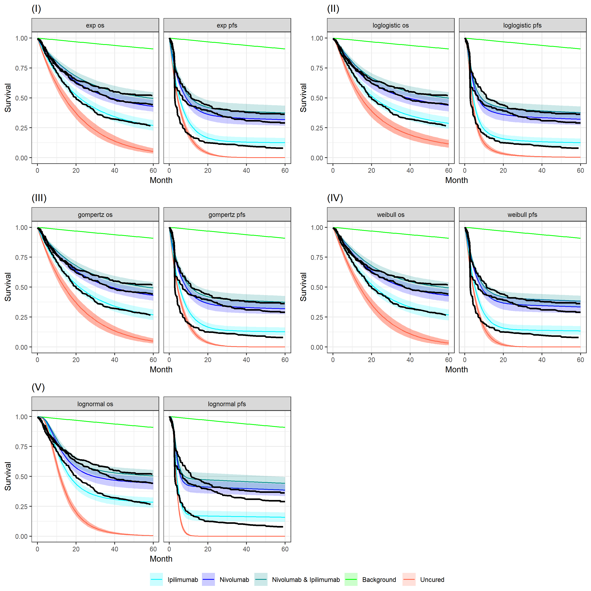
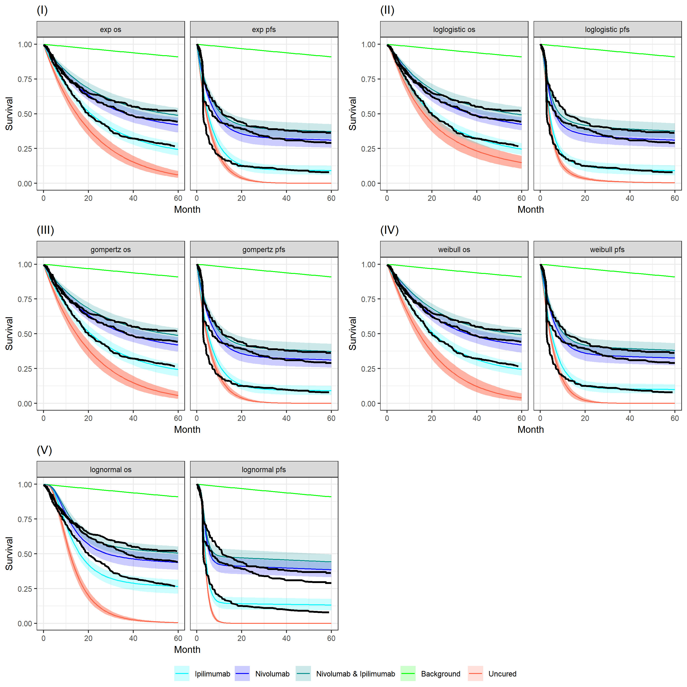

```{r, include = FALSE}
knitr::opts_chunk$set(
  collapse = TRUE,
  comment = "#>"
)
```

### Executive summary

In this project we formulate and demonstrate the application of a
Bayesian mixture cure model (MCM) using the Checkmate 067 study dataset
for a range of survival distributions. Analogous results to those
created previously for the frequentist MCM approach are produced and we
extend the Bayesian MCM to incorporate additional structure. This
includes modelling the cure fractions separately for OS and PFS (as in
the frequentist approach) and by joining the overall survival (OS) and
progression-free survival (PFS) models using a hierarchical (multilevel)
structure on the cure fraction. We show that the Exponential and in
particular the log-logistic OS and PFS Bayesian MCMs perform reasonably
well for the Checkmate 067 data. We also perform a sensitivity analysis
by increasing the background hazard rate via a hazard ratio adjustment,
representing a study population with a higher mortality rate than the
general population. The real benefit of this approach, not full explored
in this analysis, may be with other dataset where there is relatively
short follow-up or small sample sizes. The associated R code for this
work, held in a private on-line repository, has been written for re-use
and generalisability to other problems.

## Background

Immuno-oncologic (IO) studies for melanoma therapies, such as
*ipilimumab* (`ipi`), *nivolumab* (`nivo`), and the *nivolumab* with
*ipilimumab* (`nivo + ipi`) combination, have indicated that survival
curves "plateau" (a considerable proportion of patients are "long-term
survivors (LTS)").
Emergent survival plateaus in a survival model may be represented within a mixture cure model (MCM).
Usually event times, e.g. for PFS and OS, are modelled separately but this may lead to a clinically unintuitive dichotomy between proportions of long-term survivors.
It is not always possible to model PFS and OS jointly because we often have to rely on synthetic data from digitized curves, which make it impossible to retrieve the underlying correlation between the two outcomes.
But if we have access to trial data, like in the Checkmate 067 trail case, we should make the most of it.

Cure models are a special type of survival analysis where
this "cure fraction" (the underlying proportion of responders to
treatment/long-term survivors) is accounted for. Cure models estimate
the cure fraction, in addition to a parametric survival function for
patients that are not cured. The mortality risk in the cured patients is
informed by a background mortality rate. The population that is not
cured is subject both to background mortality and to additional
mortality from their cancer, estimated using a parametric survival
model.
A mixture cure model (MCM) (@Amico2018) is a type of cure model where
survival is modelled as a mixture of two groups of patients: those who
are cured and those who are not (and who therefore remain at risk). The
survival for a population with a cure fraction can be written as
follows:

```{=tex}
\begin{align}
\tag{*}
S(t, x) = S^*(t, x)[\pi(x) + (1 − \pi(x))S_u(t, x)],
\end{align}
```
where $S(t, x)$ denotes the survival at time $t$, $S^*(t, x)$ denotes
the background mortality at time $t$ conditional on covariates $x$,
$\pi(x)$ denotes the probability of being cured conditional on
covariates $x$, and $S_u(t, x)$ denotes the event (progression or
mortality) due to cancer at time $t$ conditional on covariates $x$. For
PFS, the survival is composed of either progressing to a disease state
or death.

## Aims

The aims of the the analysis in this document are as follows:

-   Demonstrate the application of a Bayesian mixture cure model using
    the Checkmate 067 study dataset and the Exponential distribution for
    event times.
-   Produce analogous results to those created previously for the
    frequentist approach.
-   Extend the Bayesian model to incorporate additional structure
    including a hierarchical cure fraction.

This analysis has been carried-out using the Stan inference engine
(@carpenter2017stan) called from R on a Windows PC. The packaged code
can be downloaded from a private GitHub repository with permission from
the package authors at
<https://github.com/StatisticsHealthEconomics/rstanbmcm>. See the *How
to use rstanbmcm* vignette for an introduction to how to use the
package.

## Likelihood

Let $T_i$ be the non-negative random variable denoting the survival time
of patient $i$ with covariate vector $\boldsymbol{x}_i$.

In the simplest case we can assume that the cure fraction is the same
for the whole population i.e. $\pi$ is fixed. Further, we can assume the
$\pi$ models the relationship between $\boldsymbol{x}_i$ and the
probability of being cured. E.g. using a logistic-linear model

$$
\pi(\boldsymbol{x}_i | \boldsymbol{\beta}) = 1/[1 + \exp(-\boldsymbol{x}_i^T \boldsymbol{\beta})].
$$

The likelihood of the standard survival is

$$
L = \prod_i S(t_i | \boldsymbol{x}_i) h(t_i | \boldsymbol{x}_i)^{\delta_i}
$$

Log-likelihood is therefore
$$
\mathcal{l} = \sum_i \log(S(t_i | \boldsymbol{x}_i)) + \delta_i \log(h(t_i | \boldsymbol{x}_i))
$$

Plugging this directly into the mixture cure equation in (\*) gives

$$
\mathcal{l}(\pi | \boldsymbol{\delta}, \boldsymbol{x}) =
 \sum_i \log(S^*(t_i | \boldsymbol{x}_i) h^*(t_i | \boldsymbol{x}_i)^{\delta_i}[\pi(x) +
   (1 − \pi(x)) S_u(t_i | \boldsymbol{x}_i) h_u(t_i | \boldsymbol{x}_i)^{\delta_i}])
$$

If we assume that the cured component is the Exponential survival model
then the non-cured component can be thought of in similar terms to the
cumulative incidence function. That is, the probability of an event is
the combined probability of surviving both events (e.g. for OS,
all-cause and cancer mortality) and then experiencing either i.e.
dropping the $S$ dependencies for brevity

```{=tex}
\begin{equation}
\tag{**}
S^* S_u (h^*)^{\delta} + S^* S_u (h_u)^{\delta} = S^* S_u (h^* + h_u)^{\delta}
\end{equation}
```

## Bayesian formulation

In a Bayesian approach to modelling (@McElreath2018), all quantities
that are subject to uncertainty are modelled using probability
distributions. This applies to observed data (e.g. time to PFS for a
given individual), that are subject to sampling variability, as well as
to unobservable parameters (e.g. the coefficient quantifying the impact
of age or sex over the average survival curve). In this latter case,
probability distributions are used to model the epistemic uncertainty
(e.g. the fact that we do not know for certain what the "true"
underlying value of the model parameter is). In addition, we may model
as yet unobserved (but potentially observable) quantities using a
suitable probability model. For example, we could consider the
extrapolated part of the survival curve as subject to uncertainty due to
the current sampling process giving rise to the data that are actually
observed, as well as the uncertainty on the underlying data generating
process.

We can mix different sources of evidence to form our "prior"
distributions, which are used to describe the state of science on the
model parameters. These are then combined with any observed data to form
an updated level of knowledge. This process is particularly relevant in
the case at hand, when data can only inform about limited aspects of the
overall underlying reality. For this reason, it is important to a)
include information/evidence available in the form of external data
and/or expert opinion; b) extract the most information possible from the
available data (e.g. by formally trying to model the correlation between
the PFS and the OS data to borrow strength from the more mature set of
observations).

A built-in advantage of the Bayesian procedure is that uncertainty is
directly and formally propagated to an economic model; the main output
from the statistical analysis (the extrapolated survival curve) are
produced by default as based on a full posterior distribution. From
this, we can easily derive a "base case" (e.g. taking the mean value)
but without the need for further tools (such as bootstrap) we already
have a full characterisation of the underlying uncertainty that can be
used in the process of probabilistic sensitivity analysis. We can
moreover add information in the priors to ensure that the extrapolation
beyond the observed data is realistic and consistent with the clinical
expertise (e.g. by "anchoring" the extrapolated survival curve to be
probabilistically below the curves for the healthy population, or by
ensuring that OS behaves in a way to respect some agreed level of
similarity, or correlation, to PFS).

#### Posterior equation

Using the likelihood function defined above and prior distributions on
uncertain parameters, we can specify the posterior distribution.
Defining $g_2$ as the prior distribution for the coefficients of the
uncured fraction $\beta^u$ and $g_3$ as the prior distribution for the
coefficients of the cured fraction $\beta^*$, then the general form of
the posterior distribution can be written as follows.

$$
p(\pi, \boldsymbol{\beta^u}, \boldsymbol{\beta^*} | \boldsymbol{\delta}, \boldsymbol{x}) \propto
L(\pi, \boldsymbol{\beta^u}, \boldsymbol{\beta^*} | \boldsymbol{\delta}, \boldsymbol{x}) f(\pi) g_2(\boldsymbol{\beta^u}) g_3(\boldsymbol{\beta^*})
$$

assuming that the cure fraction is independent of the covariates.

### Cure fraction

There are two obvious ways to represent the uncertainty about the cure
fraction in the model.

The first is to specify the cure fraction directly using a
$\pi \sim Beta(a_{cf}, b_{cf})$ prior, most uninformative as a uniform
$Beta(1,1)$. The parameters can be obtained via transformation of mean
and standard deviation to allow a more natural scale for elicitation.

Alternatively, we may specify the uncertainty on the real line with a
Normal distribution and then transform to the probability scale.

A further consideration is how to represent the cure fraction so to
share information between the OS and PFS data. We will investigate 3
alternatives.

-   *Pooled*: Assume that the cure fraction is the same for OS and PFS
    i.e. $\pi_{os} = \pi_{os} = \pi$ where $$
    logit(\pi) \sim N(\mu_{cf}, \sigma_{cf}^2), \;\;
    $$
-   *Separate*: Model each independently. $$
    logit(\pi_{os}) \sim N(\mu_{cfos}, \sigma_{cfos}^2), \;\;  
    logit(\pi_{pfs}) \sim N(\mu_{cfpfs}, \sigma_{cfpfs}^2)  
    $$
-   *Hierarchical*: Assume exchangeability between OS and PFS$$
    \pi \sim N(\mu_{cf}, \sigma_{cf}^2), \;\;  
    logit(\pi_{os}) \sim N(\pi, \sigma_{cfos}^2), \;\;  
    logit(\pi_{pfs}) \sim N(\pi, \sigma_{cfpfs}^2)  
    $$

Below is an example DAG for the hierarchical cure fraction without a
joint time to event component. Notice that even without the direct
relationship between PFS and OS there is still an indirect influence via
$\pi$.

```{r, echo=FALSE, fig.align='center', out.width="40%", fig.cap="\\label{fig:hier_dag} Hierarchical cure fraction DAG."}
knitr::include_graphics("hierarchical_DAG.png")
```

## Background survival

The previous frequentist analysis used the World Health Organization
(WHO) life tables by country for the latest year available of 2016
(@wholifetables) to inform the background mortality rate (baseline
hazard). These baseline hazards are the expected mortality rate for each
patient at the age at which they experience the event. The mortality
data are age- and gender adjusted, thus providing a granular account of
the different patient profiles in the trial. The WHO reports conditional
probabilities of death in 5-year intervals until age 85. A constant
annual mortality rate is reported for individuals over 85. They assumed
that the maximum age is 100 years.

In a Bayesian analysis there are alternative ways in which we could
model the background mortality.

For this work we shall use WHO hazard point estimates as known. We could
consider the WHO estimates to provide sufficiently accurate estimates
given the sample size and so incorporating uncertainty is not necessary.
This also forces consistency across fits. Denote the WHO estimates for
individual $i$ as $\hat{f}_i, \hat{S}_i, \hat{h}_i$ for the density,
survival and hazard respectively.

This gives the likelihood

$$
L(\pi | \boldsymbol{\delta}, \boldsymbol{x}, \hat{S}, \hat{h}) =
\sum_i \hat{S}_i \hat{h}_i^{\delta_i} \left[ \pi(x) + (1 - \pi(x)) S_{u, i} h_{u , i}^{\delta_i} \right]
$$

## Model goodness-of-fit
Model fit was determined using the leave-one-out (LOO) cross validation statistics using WAIC (@Vehtari2017). A small statistic is preferable.

## Variance partition coefficient (VPC)
The variance partition coefficient (VPC) is defined as
$\sigma_{global}^2/ (\sigma_{global}^2 + \sigma_{e}^2)$ where $e = PFS$
or $OS$.
This indicates what proportion of the total variance is
attributable to variation within-groups, or how much is found between-groups.


## Results

We fit the separate and exchangeable cure fraction models to the study
data and produced the posterior survival curves below.

For each model and treatment we produce the expected survival curves
with 95% Credible Intervals (CrI). The OS curves are to the left-hand
side and PFS curves to the right-hand side. Background mortality (i.e.
cured patients) is indicated by the red line. Non-cured patients
survival curves are shown in dark green and blue for OS and PFS
respectively. Light green and magenta are the total sample. The black
line is the Kaplan-Meier curve for the observed data. Note that these
plots are for an average individual, e.g. at average age, and so we
would not expect them to perfectly match the sample data Kaplan-Meier.

### Separate survival models for OS and PFS

Figure \ref{fig:S_separate} shows posterior survival curves for the
Exponential, log-logistic, Gompertz, Weibull and log-Normal models when
the OS and PFS models are fitted separately.
```{r fig.show='hold', fig.align='center', out.width="15cm", out.height="40cm", echo=FALSE, message = FALSE, warning = FALSE, fig.cap="\\label{fig:S_separate}Posterior survival curves for the mixture cure model for separate OS and PFS models and $ipilimumab$, $nivolumab$ and a combination treatment arm. The green line is cured background. Uncured distributions are I) Exponential  II) Log-logistic III) Gompertz IV) Weibull V) Log-Normal."}

```

Figure \ref{fig:forest_separate} shows the forest plots of cure fraction posterior distributions.
```{r fig.show='hold', fig.align='center', out.width="60%", echo=FALSE, fig.cap="\\label{fig:forest_separate}Forest plot of cure fraction posterior distributions for separate OS and PFS models ."}
knitr::include_graphics("../plots/cf separate_bg_fixed_forest_plot.png")
```

Table 1 gives values for these posterior cure fractions.
```{r echo=FALSE, message=FALSE}
load("checkmate_report_data/tab_cf separate.RData")
names(tab_dat)[names(tab_dat) == "1"] <- "OS distn"
names(tab_dat)[names(tab_dat) == "2"] <- "PFS distn"
names(tab_dat)[names(tab_dat) == "3"] <- "Treatment"
tab_dat$Treatment <- stringr::str_to_sentence(tab_dat$Treatment)
tab_dat$ID <- 1:nrow(tab_dat)
knitr::kable(tab_dat, caption = "Posterior cure fractions for separate model.")
```

Table 2 gives the leave-one-out cross validation statistics for
each model fit using WAIC.
```{r echo=FALSE, message=FALSE}
load("checkmate_report_data/tab_loo_cf separate.RData")
tab_loo$Treatment <- stringr::str_to_sentence(tab_loo$Treatment)
rownames(tab_loo) <- NULL
tab_loo <- dplyr::filter(tab_loo,grepl("^waic", Statistic))
tab_loo <- tab_loo[, -1]
knitr::kable(tab_loo, caption = "Leave-one-out cross validation statistics for each model fit using WAIC for separate model.")
```
From Table 2 we see that from the WAIC point estimates
the best fits are the nivolumab+ipilimumab followed by the nivolumab separate models.
The log-normal models have the best fits for all treatments, followed by either the loglogistic (nivolumab+ipilimumab, nivolumab) or exponential (ipilimumab).


### Hierarchical model with exchangeable cure fraction for OS and PFS

Figure \ref{fig:S_hier} shows
posterior survival curves for the Exponential, log-logistic, Gompertz,
Weibull and log-Normal models when the OS and PFS models share
information with exchangeable cure fractions.

```{r fig.show='hold', fig.align='center', out.width="15cm", out.height="40cm", echo=FALSE, message = FALSE, warning = FALSE, fig.cap="\\label{fig:S_hier}Posterior survival curves for the mixture cure model for hierarchical OS and PFS models and $ipilimumab$, $nivolumab$ and a combination treatment arm. The green line is cured background. Uncured distributions are I) Exponential  II) Log-logistic III) Gompertz IV) Weibull V) Log-Normal."}

```

Figure \ref{fig:forest_hier} shows the forest plots of cure fraction
posterior distributions. We see that the values are generally similar
for the Exponential and log-logistic fits. This clearly shows how the
global cure fraction posterior distribution lies partway between the PFS
and OS distributions.

```{r fig.show='hold', fig.align='center', out.width="60%", echo=FALSE, fig.cap="\\label{fig:forest_hier}Forest plot of cure fraction posterior distributions for exchangeable model."}
# knitr::include_graphics("../plots/cf_forest_plot.png")
knitr::include_graphics("../plots/cf hier_bg_fixed_forest_plot.png")
```

Table 3 summarises the cure fraction posterior distribution for each scenario.

```{r cf_hier, echo=FALSE, message=FALSE}
load("checkmate_report_data/tab_cf hier.RData")
names(tab_dat)[names(tab_dat) == "1"] <- "OS distn"
names(tab_dat)[names(tab_dat) == "2"] <- "PFS distn"
names(tab_dat)[names(tab_dat) == "3"] <- "Treatment"
tab_dat$Treatment <- stringr::str_to_sentence(tab_dat$Treatment)
knitr::kable(tab_dat, caption = "Cure fraction posterior distribution for hierarchical model.")
```

Table 4 gives the leave-one-out cross validation WAIC statistics for each model fit.

```{r echo=FALSE, message=FALSE}
load("checkmate_report_data/tab_loo_cf hier.RData")
tab_loo$Treatment <- stringr::str_to_sentence(tab_loo$Treatment)
rownames(tab_loo) <- NULL
tab_loo <- dplyr::filter(tab_loo,grepl("^waic", Statistic))
tab_loo <- tab_loo[, -1]
knitr::kable(tab_loo, caption = "Leave-one-out WAIC cross validation statistics for hierarchical model.")
```
We see that, corresponding to the separate model results,
the best fitting models are for the nivolumab+ipilimumab followed by nivolumab hierarchical models.
Again, the best fitting distributions are lognormal followed by loglogistic.

In comparison with the separate model fits, the WAIC for the hierarchical models are mostly better and when the separate model has smaller estimate it is by a small margin of error.


Table 5 shows the variance partition coefficient (VPC).
```{r echo=FALSE, message=FALSE}
load("checkmate_report_data/tab_vpc.RData")
tab_vpc <- 
  tidyr::separate(tab_vpc, scenarios, into = c("OS", "PFS", "Treatment"), sep = "_")
tab_vpc$Treatment <- stringr::str_to_sentence(tab_vpc$Treatment)
  
knitr::kable(tab_vpc, caption = "Variance partition coefficient (VPC) for hierachical model.")
```

It appears the above table that much of the variation is due to between
PFS and OS indicating distinct cure fractions in each.
This is to be expected since there are only two points informing the global cure fraction distributions.


## Sensitivity analysis for background mortality

As a sensitivity analysis, an adjustment factor was applied to the
general population mortality rates to allow for an assessment of the
impact of background hazards on estimation of the cure fraction. A
hazard ratio of 1.63 was applied to the background hazard. This was
obtained from a previous ad-hoc analysis which compared the WHO life
tables with the OS data for complete responders (CR) from CheckMate 067
(N=120, pooled across all 3 arms).


Table 6 summarises the cure fraction posterior distribution for each scenario.

```{r echo=FALSE, message=FALSE}
load("checkmate_report_data/tab_cf hier_bg_fixed_hr1.63.RData")
names(tab_dat)[names(tab_dat) == "1"] <- "OS distn"
names(tab_dat)[names(tab_dat) == "2"] <- "PFS distn"
names(tab_dat)[names(tab_dat) == "3"] <- "Treatment"
tab_dat$Treatment <- stringr::str_to_sentence(tab_dat$Treatment)
knitr::kable(tab_dat, caption = "Cure fraction posterior distribution for background adjusted model.")
```


Figure \ref{fig:forest_global_163} shows the equivalent posterior
survival curves to Figures \ref{fig:forest_hier} for the combined
$ipilimumab$ and $nivolumab$ treatment and background hazard ratio
adjustment 1.63.

```{r fig.show='hold', fig.align='center', out.width="60%", echo=FALSE, fig.cap="\\label{fig:forest_global_163}Forest plot of cure fraction posterior distributions for dual $ipilimumab$ and $nivolumab$ and background hazard ratio adjustment 1.63."}
knitr::include_graphics("../plots/cf hier_bg_fixed_hr1.63_forest_plot.png")
```

\newpage

Table 7 gives the leave-one-out cross validation statistics for each model fit.

```{r echo=FALSE, message=FALSE}
load("checkmate_report_data/tab_loo_cf hier_bg_fixed_hr1.63.RData")
tab_loo$Treatment <- stringr::str_to_sentence(tab_loo$Treatment)
rownames(tab_loo) <- NULL
tab_loo <- dplyr::filter(tab_loo,grepl("^waic", Statistic))
tab_loo <- tab_loo[, -1]
knitr::kable(tab_loo, caption = "Leave-one-out WAIC cross validation statistics for background adjusted model.")
```
## Conclusions

We have presented a Bayesian hierarchical MCM framework which can alleviate the disparity between individually estimated OS- and PFS-based LTS rates. It also provides a single shared cure fraction makes sense both from a HTA perspective, enabling ‘borrowing of strength’ from PFS for OS and more robust by leveraging all data in the presence of varying rates of censoring, and from clinical perspective, where we would expect equivalent LTS proportion across OS and PFS.
Further, the parametric Bayesian models enable extrapolation to lifetime with uncertainty which are crucial for HTA and QALY estimation.

This work has some current limitations.
The presented analysis was restricted to same distribution combinations for OS and PFS but there is no reason why any combination could be considered.
We also only used vague uninformative prior distributions in the Bayesian model.

Future planned extensions include the examination of all combinations of distributions for OS and PFS.
We will also incorporate prior clinical input into analysis and model selection.
<!-- statements around the certainty of the outcome -->
Because our proposed Bayesian model produces posterior distributions this can be used as part of a wider probabilistic decision-theoretic approach. A given model could be used to evaluate optimal courses of action e.g. in deciding between preferable drug treatments.
Probabilistic statement can be made not just about which course of action to take but also the confidence in taking that action.
Commonly, clinical decisions are posed in terms of a cost-effectiveness analysis.
Finally, the development of these methods and dissemination of easy-to-use, scalable, open-source R package for external users will be done.


\newpage

## References
