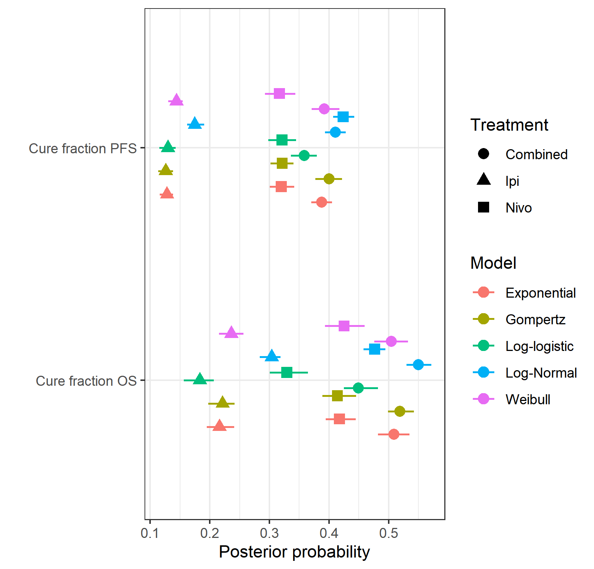
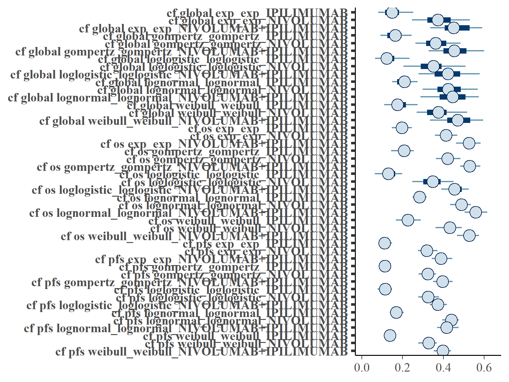
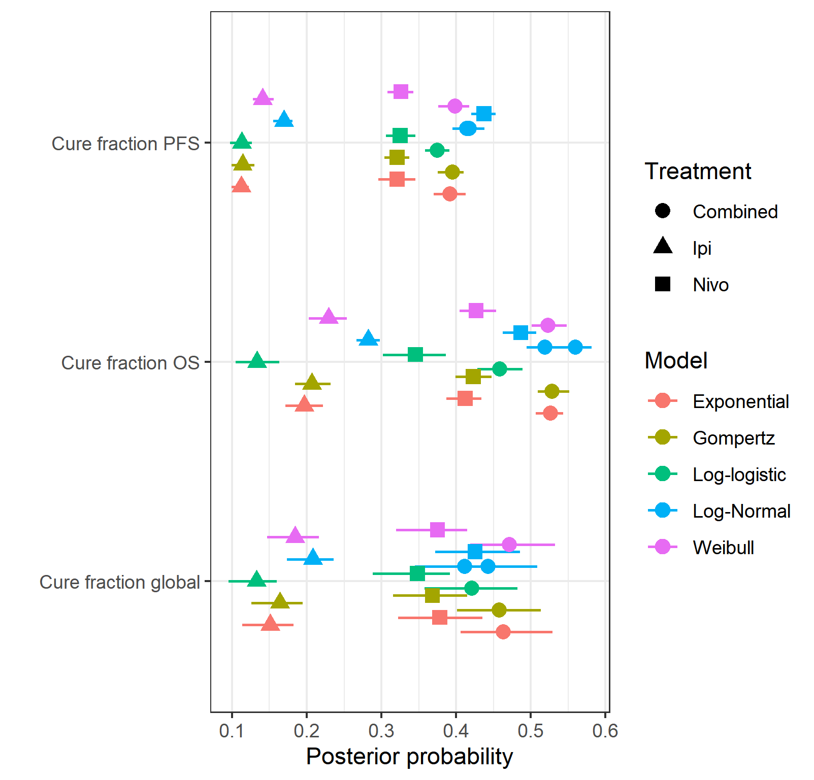
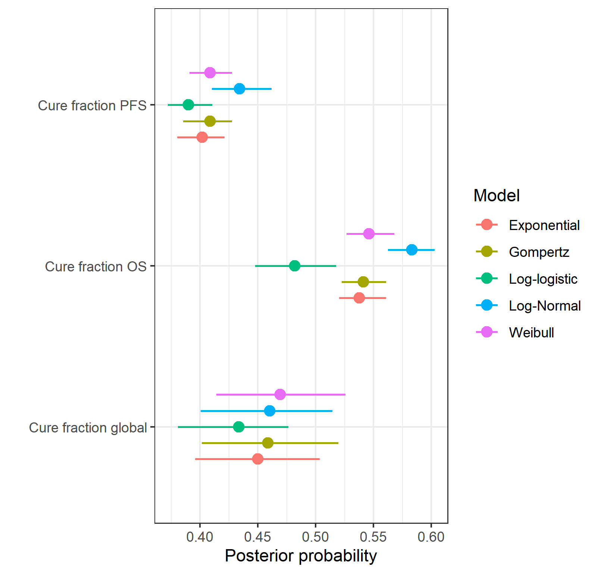

```{r, include = FALSE}
knitr::opts_chunk$set(
  collapse = TRUE,
  comment = "#>"
)
```

### Executive summary

In this project we formulate and demonstrate the application of a
Bayesian mixture cure model (MCM) using the Checkmate 067 study dataset
for a range of survival distributions.
Analogous results to those created previously for the frequentist MCM
approach are produced and we extend the Bayesian MCM to incorporate
additional structure. This includes modelling the cure fractions separately
for OS and PFS (as in the frequentist approach)
and by joining the overall survival (OS) and
progression-free survival (PFS) models using a hierarchical (multilevel)
structure on the cure fraction. We show that the Exponential and in particular the
log-logistic OS and PFS Bayesian MCMs perform reasonably well for the
Checkmate 067 data.
We also perform a sensitivity analysis by increasing the background hazard rate
via a hazard ratio adjustment, representing a study population with a higher
mortality rate than the general population.
The real benefit of this approach, not full explored in this analysis, may be with other
dataset where there is relatively short follow-up or small sample sizes.
The associated R code for this work, held in a private on-line repository,
has been written for re-use and generalisability to other problems.


## Background

Immuno-oncologic (IO) studies for melanoma therapies, such as
*ipilimumab* (`ipi`), *nivolumab* (`nivo`), and the *nivolumab* with
*ipilimumab* (`nivo + ipi`) combination, have indicated that survival
curves "plateau" (a considerable proportion of patients are "long-term
survivors"). Cure models are a special type of survival analysis where
this "cure fraction" (the underlying proportion of responders to
treatment/long-term survivors) is accounted for. Cure models estimate
the cure fraction, in addition to a parametric survival function for
patients that are not cured. The mortality risk in the cured patients is
informed by a background mortality rate. The population that is not
cured is subject both to background mortality and to additional
mortality from their cancer, estimated using a parametric survival
model.

A mixture cure model (MCM) (@Amico2018) is a type of cure model where
survival is modelled as a mixture of two groups of patients: those who
are cured and those who are not (and who therefore remain at risk). The
survival for a population with a cure fraction can be written as
follows:

```{=tex}
\begin{align}
\tag{*}
S(t, x) = S^*(t, x)[\pi(x) + (1 − \pi(x))S_u(t, x)],
\end{align}
```
where $S(t, x)$ denotes the survival at time $t$, $S^*(t, x)$ denotes
the background mortality at time $t$ conditional on covariates $x$,
$\pi(x)$ denotes the probability of being cured conditional on
covariates $x$, and $S_u(t, x)$ denotes the event (progression or
mortality) due to cancer at time $t$ conditional on covariates $x$. For
PFS, the survival is composed of either progressing to a disease state
or death.

## Aims

The aims of the the analysis in this document are as follows:

-   Demonstrate the application of a Bayesian mixture cure model using
    the Checkmate 067 study dataset and the Exponential distribution for
    event times.
-   Produce analogous results to those created previously for the
    frequentist approach.
-   Extend the Bayesian model to incorporate additional structure
    including a hierarchical cure fraction.

This analysis has been carried-out using the Stan inference engine
(@carpenter2017stan) called from R on a Windows PC. The packaged code
can be downloaded from a private GitHub repository with permission from
the package authors at
<https://github.com/StatisticsHealthEconomics/rstanbmcm>. See the *How
to use rstanbmcm* vignette for an introduction to how to use the
package.

## Likelihood

Let $T_i$ be the non-negative random variable denoting the survival time
of patient $i$ with covariate vector $\boldsymbol{x}_i$.

In the simplest case we can assume that the cure fraction is the same
for the whole population i.e. $\pi$ is fixed. Further, we can assume the
$\pi$ models the relationship between $\boldsymbol{x}_i$ and the
probability of being cured. E.g. using a logistic-linear model

$$
\pi(\boldsymbol{x}_i | \boldsymbol{\beta}) = 1/[1 + \exp(-\boldsymbol{x}_i^T \boldsymbol{\beta})].
$$

The likelihood of the standard survival is

$$
L = \prod_i S(t_i | \boldsymbol{x}_i) h(t_i | \boldsymbol{x}_i)^{\delta_i}
$$

Log-likelihood is therefore $$
\mathcal{l} = \sum_i \log(S(t_i | \boldsymbol{x}_i)) + \delta_i \log(h(t_i | \boldsymbol{x}_i))
$$

Plugging this directly into the mixture cure equation in (\*) gives

$$
\mathcal{l}(\pi | \boldsymbol{\delta}, \boldsymbol{x}) =
 \sum_i \log(S^*(t_i | \boldsymbol{x}_i) h^*(t_i | \boldsymbol{x}_i)^{\delta_i}[\pi(x) +
   (1 − \pi(x)) S_u(t_i | \boldsymbol{x}_i) h_u(t_i | \boldsymbol{x}_i)^{\delta_i}])
$$

If we assume that the cured component is the Exponential survival model
then the non-cured component can be thought of in similar terms to the
cumulative incidence function. That is, the probability of an event is
the combined probability of surviving both events (e.g. for OS,
all-cause and cancer mortality) and then experiencing either i.e.
dropping the $S$ dependencies for brevity

```{=tex}
\begin{equation}
\tag{**}
S^* S_u (h^*)^{\delta} + S^* S_u (h_u)^{\delta} = S^* S_u (h^* + h_u)^{\delta}
\end{equation}
```
## Bayesian formulation

In a Bayesian approach to modelling (@McElreath2018),
all quantities that are subject to
uncertainty are modelled using probability distributions. This applies
to observed data (e.g. time to PFS for a given individual), that are
subject to sampling variability, as well as to unobservable parameters
(e.g. the coefficient quantifying the impact of age or sex over the
average survival curve). In this latter case, probability distributions
are used to model the epistemic uncertainty (e.g. the fact that we do
not know for certain what the "true" underlying value of the model
parameter is). In addition, we may model as yet unobserved (but
potentially observable) quantities using a suitable probability model.
For example, we could consider the extrapolated part of the survival
curve as subject to uncertainty due to the current sampling process
giving rise to the data that are actually observed, as well as the
uncertainty on the underlying data generating process.

We can mix different sources of evidence to form our "prior"
distributions, which are used to describe the state of science on the
model parameters. These are then combined with any observed data to form
an updated level of knowledge. This process is particularly relevant in
the case at hand, when data can only inform about limited aspects of the
overall underlying reality. For this reason, it is important to a)
include information/evidence available in the form of external data
and/or expert opinion; b) extract the most information possible from the
available data (e.g. by formally trying to model the correlation between
the PFS and the OS data to borrow strength from the more mature set of
observations).

A built-in advantage of the Bayesian procedure is that uncertainty is
directly and formally propagated to an economic model; the main output
from the statistical analysis (the extrapolated survival curve) are
produced by default as based on a full posterior distribution. From
this, we can easily derive a "base case" (e.g. taking the mean value)
but without the need for further tools (such as bootstrap) we already
have a full characterisation of the underlying uncertainty that can be
used in the process of probabilistic sensitivity analysis. We can
moreover add information in the priors to ensure that the extrapolation
beyond the observed data is realistic and consistent with the clinical
expertise (e.g. by "anchoring" the extrapolated survival curve to be
probabilistically below the curves for the healthy population, or by
ensuring that OS behaves in a way to respect some agreed level of
similarity, or correlation, to PFS).

#### Posterior equation

Using the likelihood function defined above and prior distributions on
uncertain parameters, we can specify the posterior distribution.
Defining $g_2$ as the prior distribution for the coefficients of the
uncured fraction $\beta^u$ and $g_3$ as the prior distribution for the
coefficients of the cured fraction $\beta^*$, then the general form of
the posterior distribution can be written as follows.

$$
p(\pi, \boldsymbol{\beta^u}, \boldsymbol{\beta^*} | \boldsymbol{\delta}, \boldsymbol{x}) \propto
L(\pi, \boldsymbol{\beta^u}, \boldsymbol{\beta^*} | \boldsymbol{\delta}, \boldsymbol{x}) f(\pi) g_2(\boldsymbol{\beta^u}) g_3(\boldsymbol{\beta^*})
$$

assuming that the cure fraction is independent of the covariates.

### Cure fraction

There are two obvious ways to represent the uncertainty about the cure
fraction in the model.

The first is to specify the cure fraction directly using a
$\pi \sim Beta(a_{cf}, b_{cf})$ prior, most uninformative as a uniform
$Beta(1,1)$. The parameters can be obtained via transformation of mean
and standard deviation to allow a more natural scale for elicitation.

Alternatively, we may specify the uncertainty on the real line with a
Normal distribution and then transform to the probability scale.

A further consideration is how to represent the cure fraction so to
share information between the OS and PFS data. We will investigate 3
alternatives.

-   *Pooled*: Assume that the cure fraction is the same for OS and PFS
    i.e. $\pi_{os} = \pi_{os} = \pi$ where $$
    logit(\pi) \sim N(\mu_{cf}, \sigma_{cf}^2), \;\;
    $$
-   *Separate*: Model each independently. $$
    logit(\pi_{os}) \sim N(\mu_{cfos}, \sigma_{cfos}^2), \;\;  
    logit(\pi_{pfs}) \sim N(\mu_{cfpfs}, \sigma_{cfpfs}^2)  
    $$
-   *Hierarchical*: Assume exchangeability between OS and PFS$$
    \pi \sim N(\mu_{cf}, \sigma_{cf}^2), \;\;  
    logit(\pi_{os}) \sim N(\pi, \sigma_{cfos}^2), \;\;  
    logit(\pi_{pfs}) \sim N(\pi, \sigma_{cfpfs}^2)  
    $$

Below is an example DAG for the hierarchical cure fraction without a
joint time to event component. Notice that even without the direct
relationship between PFS and OS there is still an indirect influence via
$\pi$.

```{r, echo=FALSE, fig.align='center', out.width="40%", fig.cap="\\label{fig:hier_dag} Hierarchical cure fraction DAG."}
knitr::include_graphics("hierarchical_DAG.png")
```

## Background survival

The previous frequentist analysis used the World Health Organization
(WHO) life tables by country for the latest year available of 2016
(@wholifetables) to inform the background mortality rate (baseline
hazard). These baseline hazards are the expected mortality rate for each
patient at the age at which they experience the event. The mortality
data are age- and gender adjusted, thus providing a granular account of
the different patient profiles in the trial. The WHO reports conditional
probabilities of death in 5-year intervals until age 85. A constant
annual mortality rate is reported for individuals over 85. They assumed
that the maximum age is 100 years.

In a Bayesian analysis there are alternative ways in which we could
model the background mortality.

For this work we shall use WHO hazard point estimates as known. We could
consider the WHO estimates to provide sufficiently accurate estimates
given the sample size and so incorporating uncertainty is not necessary.
This also forces consistency across fits. Denote the WHO estimates for
individual $i$ as $\hat{f}_i, \hat{S}_i, \hat{h}_i$ for the density,
survival and hazard respectively.

This gives the likelihood

$$
L(\pi | \boldsymbol{\delta}, \boldsymbol{x}, \hat{S}, \hat{h}) =
\sum_i \hat{S}_i \hat{h}_i^{\delta_i} \left[ \pi(x) + (1 - \pi(x)) S_{u, i} h_{u , i}^{\delta_i} \right]
$$


## Results

We fit the separate and exchangeable cure fraction models to the study data and produced the
posterior survival curves below.

For each model and treatment we produce the expected survival curves with 95% Credible Intervals (CrI). The
    OS curves are to the left-hand side and PFS curves to the right-hand
    side. Background mortality (i.e. cured patients) is indicated by the
    red line. Non-cured patients survival curves are shown in dark green
    and blue for OS and PFS respectively. Light green and magenta are
    the total sample. The black line is the Kaplan-Meier curve for the
    observed data. Note that these plots are for an average individual,
    e.g. at average age, and so we would not expect them to perfectly
    match the sample data Kaplan-Meier.


### Separate survival models for OS and PFS 

Figures \ref{fig:IPI_separate}, \ref{fig:NIVO_separate}, and \ref{fig:NIVO+IPI_separate} show
posterior survival curves for the Exponential, log-logistic, Gompertz, Weibull and log-Normal models
when the OS and PFS models are fitted separately.

```{r fig.show='hold', fig.align='center', out.width="25cm", out.height="40cm", echo=FALSE, message = FALSE, warning = FALSE, fig.cap="\\label{fig:IPI_separate}Posterior survival curves for the mixture cure model for separate OS and PFS models and $ipilimumab$. The red line is cured background, light green and blue are uncured, and dark green and magenta are combined. a) Exponential uncured b) Log-logistic uncured c) Gompertz uncured d) Weibull uncured e) Log-Normal uncured."}
library(magick)
library(grid)

rl <- list()
rl[[1]] <-
  image_read("../plots/S_plots_exp_exp_cf separate_bg_fixed_IPILIMUMAB.png") %>%
  image_annotate(" a)", size = 70)
rl[[2]] <-
  image_read("../plots/S_plots_loglogistic_loglogistic_cf separate_bg_fixed_IPILIMUMAB.png") %>%
  image_annotate(" b)", size = 70)
rl[[3]] <-
  image_read("../plots/S_plots_gompertz_gompertz_cf separate_bg_fixed_IPILIMUMAB.png") %>%
  image_annotate(" c)", size = 70)
rl[[4]] <-
  image_read("../plots/S_plots_weibull_weibull_cf separate_bg_fixed_IPILIMUMAB.png") %>%
  image_annotate(" d)", size = 70)
rl[[5]] <-
  image_read("../plots/S_plots_lognormal_lognormal_cf separate_bg_fixed_IPILIMUMAB.png") %>%
  image_annotate(" e)", size = 70)

gl <- lapply(rl, grid::rasterGrob)
gridExtra::marrangeGrob(grobs = gl,
                        nrow = 3, ncol = 2,
                        top = "",
                        # heights = unit(c(4,4,4), "cm"),
                        widths = c(4,4,4)#,
                        # vp=grid::viewport(width=0.5, height=1, clip = TRUE)
                        )
```

```{r fig.show='hold', fig.align='center', out.width="25cm", out.height="40cm", echo=FALSE, message = FALSE, warning = FALSE, fig.cap="\\label{fig:NIVO_separate}Posterior survival curves for the mixture cure model for separate OS and PFS models and $nivolumab$. The red line is cured background, light green and blue are uncured, and dark green and magenta are combined. a) Exponential uncured b) Log-logistic uncured c) Gompertz uncured d) Weibull uncured e) Log-Normal uncured."}
library(magick)
library(grid)

rl <- list()
rl[[1]] <-
  image_read("../plots/S_plots_exp_exp_cf separate_bg_fixed_NIVOLUMAB.png") %>%
  image_annotate(" a)", size = 70)
rl[[2]] <-
  image_read("../plots/S_plots_loglogistic_loglogistic_cf separate_bg_fixed_NIVOLUMAB.png") %>%
  image_annotate(" b)", size = 70)
rl[[3]] <-
  image_read("../plots/S_plots_gompertz_gompertz_cf separate_bg_fixed_NIVOLUMAB.png") %>%
  image_annotate(" c)", size = 70)
rl[[4]] <-
  image_read("../plots/S_plots_weibull_weibull_cf separate_bg_fixed_NIVOLUMAB.png") %>%
  image_annotate(" d)", size = 70)
rl[[5]] <-
  image_read("../plots/S_plots_lognormal_lognormal_cf separate_bg_fixed_NIVOLUMAB.png") %>%
  image_annotate(" e)", size = 70)

gl <- lapply(rl, grid::rasterGrob)
gridExtra::marrangeGrob(grobs = gl,
                        nrow = 3, ncol = 2,
                        top = "",
                        widths = c(4,4,4))
```

```{r fig.show='hold', fig.align='center', out.width="25cm", out.height="40cm", echo=FALSE, message = FALSE, warning = FALSE, fig.cap="\\label{fig:NIVO+IPI_separate}Posterior survival curves for the mixture cure model for separate OS and PFS models and $ipilimumab$ and $nivolumab$. The red line is cured background, light green and blue are uncured, and dark green and magenta are combined. a) Exponential uncured b) Log-logistic uncured c) Gompertz uncured d) Weibull uncured e) Log-Normal uncured."}
library(magick)
library(grid)

rl <- list()
rl[[1]] <-
  image_read("../plots/S_plots_exp_exp_cf separate_bg_fixed_NIVOLUMAB+IPILIMUMAB.png") %>%
  image_annotate(" a)", size = 70)
rl[[2]] <-
  image_read("../plots/S_plots_loglogistic_loglogistic_cf separate_bg_fixed_NIVOLUMAB+IPILIMUMAB.png") %>%
  image_annotate(" b)", size = 70)
rl[[3]] <-
  image_read("../plots/S_plots_gompertz_gompertz_cf separate_bg_fixed_NIVOLUMAB+IPILIMUMAB.png") %>%
  image_annotate(" c)", size = 70)
rl[[4]] <-
  image_read("../plots/S_plots_weibull_weibull_cf separate_bg_fixed_NIVOLUMAB+IPILIMUMAB.png") %>%
  image_annotate(" d)", size = 70)
rl[[5]] <-
  image_read("../plots/S_plots_lognormal_lognormal_cf separate_bg_fixed_NIVOLUMAB+IPILIMUMAB.png") %>%
  image_annotate(" e)", size = 70)

gl <- lapply(rl, grid::rasterGrob)
gridExtra::marrangeGrob(grobs = gl,
                        nrow = 3, ncol = 2,
                        top = "",
                        widths = c(4,4,4))
```

Figures \ref{fig:forest_separate}
shows the forest plots of cure fraction posterior distributions.

```{r fig.show='hold', fig.align='center', out.width="60%", echo=FALSE, fig.cap="\\label{fig:forest_separate}Forest plot of cure fraction posterior distributions for separate OS and PFS models ."}

```

|   | OS Distn   | PFS Distn  | Treatment           | $cf_{OS}$ (CrI)     | $cf_{PFS}$ (CrI)    |
|:--|:-----------|:-----------|:--------------------|:--------------------|:--------------------|
|1  |exp         |exp         |IPILIMUMAB           |0.216 (0.16, 0.271)  |0.128 (0.089, 0.173) |
|2  |exp         |exp         |NIVOLUMAB            |0.417 (0.335, 0.482) |0.32 (0.268, 0.37)   |
|3  |exp         |exp         |NIVOLUMAB+IPILIMUMAB |0.509 (0.43, 0.573)  |0.387 (0.332, 0.441) |
|4  |gompertz    |gompertz    |IPILIMUMAB           |0.221 (0.176, 0.282) |0.126 (0.092, 0.156) |
|5  |gompertz    |gompertz    |NIVOLUMAB            |0.414 (0.352, 0.477) |0.321 (0.274, 0.383) |
|6  |gompertz    |gompertz    |NIVOLUMAB+IPILIMUMAB |0.51 (0.447, 0.575)  |0.39 (0.323, 0.457)  |
|7  |loglogistic |loglogistic |IPILIMUMAB           |0.183 (0.11, 0.265)  |0.13 (0.091, 0.168)  |
|8  |loglogistic |loglogistic |NIVOLUMAB            |0.329 (0.217, 0.423) |0.321 (0.267, 0.381) |
|9  |loglogistic |loglogistic |NIVOLUMAB+IPILIMUMAB |0.449 (0.349, 0.524) |0.359 (0.308, 0.427) |
|10 |lognormal   |lognormal   |IPILIMUMAB           |0.304 (0.241, 0.378) |0.175 (0.13, 0.207)  |
|11 |lognormal   |lognormal   |NIVOLUMAB            |0.477 (0.432, 0.531) |0.424 (0.375, 0.467) |
|12 |lognormal   |lognormal   |NIVOLUMAB+IPILIMUMAB |0.55 (0.487, 0.611)  |0.411 (0.365, 0.459) |
|13 |weibull     |weibull     |IPILIMUMAB           |0.238 (0.177, 0.285) |0.146 (0.105, 0.186) |
|14 |weibull     |weibull     |NIVOLUMAB            |0.425 (0.348, 0.51)  |0.317 (0.261, 0.378) |
|15 |weibull     |weibull     |NIVOLUMAB+IPILIMUMAB |0.504 (0.423, 0.566) |0.392 (0.339, 0.45)  |


The table below gives the leave-one-out cross validation statistics for each model fit using WAIC (@Vehtari2017).


|Statistic |OS distn    |PFS distn   |Treatment            | Estimate|     SE|
|:---------|:-----------|:-----------|:--------------------|--------:|------:|
|elpd_waic |exp         |exp         |IPILIMUMAB           | -1839.45|  36.61|
|elpd_waic |exp         |exp         |NIVOLUMAB            | -1679.68|  45.72|
|elpd_waic |exp         |exp         |NIVOLUMAB+IPILIMUMAB | -1543.36|  53.33|
|elpd_waic |gompertz    |gompertz    |IPILIMUMAB           | -1839.14|  36.68|
|elpd_waic |gompertz    |gompertz    |NIVOLUMAB            | -1680.14|  45.78|
|elpd_waic |gompertz    |gompertz    |NIVOLUMAB+IPILIMUMAB | -1543.05|  53.87|
|elpd_waic |loglogistic |loglogistic |IPILIMUMAB           | -1768.28|  39.71|
|elpd_waic |loglogistic |loglogistic |NIVOLUMAB            | -1651.40|  45.77|
|elpd_waic |loglogistic |loglogistic |NIVOLUMAB+IPILIMUMAB | -1534.76|  52.63|
|elpd_waic |lognormal   |lognormal   |IPILIMUMAB           | -1561.55|  56.00|
|elpd_waic |lognormal   |lognormal   |NIVOLUMAB            | -1550.21|  59.92|
|elpd_waic |lognormal   |lognormal   |NIVOLUMAB+IPILIMUMAB | -1489.45|  58.02|
|elpd_waic |weibull     |weibull     |IPILIMUMAB           | -1821.12|  39.94|
|elpd_waic |weibull     |weibull     |NIVOLUMAB            | -1681.27|  45.63|
|elpd_waic |weibull     |weibull     |NIVOLUMAB+IPILIMUMAB | -1546.26|  53.72|
|p_waic    |exp         |exp         |IPILIMUMAB           |     5.41|   0.50|
|p_waic    |exp         |exp         |NIVOLUMAB            |     7.50|   0.60|
|p_waic    |exp         |exp         |NIVOLUMAB+IPILIMUMAB |     6.43|   0.60|
|p_waic    |gompertz    |gompertz    |IPILIMUMAB           |     5.14|   0.48|
|p_waic    |gompertz    |gompertz    |NIVOLUMAB            |     8.31|   0.74|
|p_waic    |gompertz    |gompertz    |NIVOLUMAB+IPILIMUMAB |     6.10|   0.50|
|p_waic    |loglogistic |loglogistic |IPILIMUMAB           |     8.31|   0.44|
|p_waic    |loglogistic |loglogistic |NIVOLUMAB            |     8.53|   0.47|
|p_waic    |loglogistic |loglogistic |NIVOLUMAB+IPILIMUMAB |     6.78|   0.52|
|p_waic    |lognormal   |lognormal   |IPILIMUMAB           |    13.88|   1.26|
|p_waic    |lognormal   |lognormal   |NIVOLUMAB            |    15.86|   1.40|
|p_waic    |lognormal   |lognormal   |NIVOLUMAB+IPILIMUMAB |    15.33|   1.43|
|p_waic    |weibull     |weibull     |IPILIMUMAB           |    11.28|   1.27|
|p_waic    |weibull     |weibull     |NIVOLUMAB            |     9.85|   0.96|
|p_waic    |weibull     |weibull     |NIVOLUMAB+IPILIMUMAB |    10.09|   0.95|
|waic      |exp         |exp         |IPILIMUMAB           |  3678.90|  73.23|
|waic      |exp         |exp         |NIVOLUMAB            |  3359.36|  91.45|
|waic      |exp         |exp         |NIVOLUMAB+IPILIMUMAB |  3086.73| 106.66|
|waic      |gompertz    |gompertz    |IPILIMUMAB           |  3678.27|  73.36|
|waic      |gompertz    |gompertz    |NIVOLUMAB            |  3360.29|  91.57|
|waic      |gompertz    |gompertz    |NIVOLUMAB+IPILIMUMAB |  3086.10| 107.73|
|waic      |loglogistic |loglogistic |IPILIMUMAB           |  3536.57|  79.43|
|waic      |loglogistic |loglogistic |NIVOLUMAB            |  3302.80|  91.54|
|waic      |loglogistic |loglogistic |NIVOLUMAB+IPILIMUMAB |  3069.53| 105.26|
|waic      |lognormal   |lognormal   |IPILIMUMAB           |  3123.10| 111.99|
|waic      |lognormal   |lognormal   |NIVOLUMAB            |  3100.41| 119.84|
|waic      |lognormal   |lognormal   |NIVOLUMAB+IPILIMUMAB |  2978.89| 116.03|
|waic      |weibull     |weibull     |IPILIMUMAB           |  3642.23|  79.89|
|waic      |weibull     |weibull     |NIVOLUMAB            |  3362.55|  91.25|
|waic      |weibull     |weibull     |NIVOLUMAB+IPILIMUMAB |  3092.51| 107.43|


### Exchangeable cure fraction for OS and PFS 

Figures \ref{fig:IPI}, \ref{fig:NIVO}, and \ref{fig:NIVO+IPI} show
posterior survival curves for the Exponential, log-logistic, Gompertz, Weibull and log-Normal models
when the OS and PFS models share information with exchangeable cure fractions.

```{r fig.show='hold', fig.align='center', out.width="25cm", out.height="40cm", echo=FALSE, message = FALSE, warning = FALSE, fig.cap="\\label{fig:IPI}Posterior survival curves for the mixture cure model with exchangeable cure fracion and $ipilimumab$. The red line is cured background, light green and blue are uncured, and dark green and magenta are combined. a) Exponential uncured b) Log-logistic uncured c) Gompertz uncured d) Weibull uncured e) Log-Normal uncured."}
library(magick)
library(grid)

rl <- list()
rl[[1]] <-
  image_read("../plots/S_plots_exp_exp_cf hier_bg_fixed_IPILIMUMAB.png") %>%
  image_annotate(" a)", size = 70)
rl[[2]] <-
  image_read("../plots/S_plots_loglogistic_loglogistic_cf hier_bg_fixed_IPILIMUMAB.png") %>%
  image_annotate(" b)", size = 70)
rl[[3]] <-
  image_read("../plots/S_plots_gompertz_gompertz_cf hier_bg_fixed_IPILIMUMAB.png") %>%
  image_annotate(" c)", size = 70)
rl[[4]] <-
  image_read("../plots/S_plots_weibull_weibull_cf hier_bg_fixed_IPILIMUMAB.png") %>%
  image_annotate(" d)", size = 70)
rl[[5]] <-
  image_read("../plots/S_plots_lognormal_lognormal_cf hier_bg_fixed_IPILIMUMAB.png") %>%
  image_annotate(" e)", size = 70)

gl <- lapply(rl, grid::rasterGrob)
gridExtra::marrangeGrob(grobs = gl,
                        nrow = 3, ncol = 2,
                        top = "",
                        # heights = unit(c(4,4,4), "cm"),
                        widths = c(4,4,4)#,
                        # vp=grid::viewport(width=0.5, height=1, clip = TRUE)
                        )
```

```{r fig.show='hold', fig.align='center', out.width="25cm", out.height="40cm", echo=FALSE, message = FALSE, warning = FALSE, fig.cap="\\label{fig:NIVO}Posterior survival curves for the mixture cure model with exchangeable cure fracion and $nivolumab$. The red line is cured background, light green and blue are uncured, and dark green and magenta are combined. a) Exponential uncured b) Log-logistic uncured c) Gompertz uncured d) Weibull uncured e) Log-Normal uncured."}
rl <- list()
rl[[1]] <-
  image_read("../plots/S_plots_exp_exp_cf hier_bg_fixed_NIVOLUMAB.png") %>%
  image_annotate(" a)", size = 70)
rl[[2]] <-
  image_read("../plots/S_plots_loglogistic_loglogistic_cf hier_bg_fixed_NIVOLUMAB.png") %>%
  image_annotate(" b)", size = 70)
rl[[3]] <-
  image_read("../plots/S_plots_gompertz_gompertz_cf hier_bg_fixed_NIVOLUMAB.png") %>%
  image_annotate(" c)", size = 70)
rl[[4]] <-
  image_read("../plots/S_plots_weibull_weibull_cf hier_bg_fixed_NIVOLUMAB.png") %>%
  image_annotate(" d)", size = 70)
rl[[5]] <-
  image_read("../plots/S_plots_lognormal_lognormal_cf hier_bg_fixed_NIVOLUMAB.png") %>% 
  image_annotate(" e)", size = 70)

gl <- lapply(rl, grid::rasterGrob)
gridExtra::marrangeGrob(grobs = gl,
                        nrow = 3, ncol = 2,
                        top = "",
                        widths = c(4,4,4))
```

```{r fig.show='hold', fig.align='center', out.width="25cm", out.height="40cm", echo=FALSE, message = FALSE, warning = FALSE, fig.cap="\\label{fig:NIVO+IPI}Posterior survival curves for the mixture cure model with exchangeable cure fracion and dual $ipilimumab$ and $nivolumab$. The red line is cured background, light green and blue are uncured, and dark green and magenta are combined. a) Exponential uncured b) Log-logistic uncured c) Gompertz uncured d) Weibull uncured e) Log-Normal uncured."}
rl <- list()
rl[[1]] <-
  image_read("../plots/S_plots_exp_exp_cf hier_bg_fixed_NIVOLUMAB+IPILIMUMAB.png") %>%
  image_annotate(" a)", size = 70)
rl[[2]] <-
  image_read("../plots/S_plots_loglogistic_loglogistic_cf hier_bg_fixed_NIVOLUMAB+IPILIMUMAB.png") %>%
  image_annotate(" b)", size = 70)
rl[[3]] <-
  image_read("../plots/S_plots_gompertz_gompertz_cf hier_bg_fixed_NIVOLUMAB+IPILIMUMAB.png") %>%
  image_annotate(" c)", size = 70)
rl[[4]] <-
  image_read("../plots/S_plots_weibull_weibull_cf hier_bg_fixed_NIVOLUMAB+IPILIMUMAB.png") %>%
  image_annotate(" d)", size = 70)
rl[[5]] <-
  image_read("../plots/S_plots_lognormal_lognormal_cf hier_bg_fixed_NIVOLUMAB+IPILIMUMAB.png") %>%
  image_annotate(" e)", size = 70)

gl <- lapply(rl, grid::rasterGrob)
gridExtra::marrangeGrob(grobs = gl,
                        nrow = 3, ncol = 2,
                        top = "",
                        widths = c(4,4,4))
```

Figures \ref{fig:forest_hier}
shows the forest plots of cure fraction posterior
distributions. We see that the values are generally similar for the
Exponential and log-logistic fits. This clearly shows how the global
cure fraction posterior distribution lies partway between the PFS and OS
distributions.

```{r fig.show='hold', fig.align='center', out.width="60%", echo=FALSE, fig.cap="\\label{fig:forest_hier}Forest plot of cure fraction posterior distributions for exchangeable model."}
# 

```

The table below summarises the cure fraction posterior distribution for
each scenario.

|     | OS Distn    | PFS Distn   | Treatment            | $cf$ (CrI)           | $cf_{OS}$ (CrI)      | $cf_{PFS}$ (CrI)     |
|:----|:------------|:------------|:---------------------|:---------------------|:---------------------|:---------------------|
| 1   | exp         | exp         | IPILIMUMAB           | 0.151 (0.068, 0.26)  | 0.196 (0.136, 0.255) | 0.112 (0.079, 0.155) |
| 2   | exp         | exp         | NIVOLUMAB            | 0.378 (0.216, 0.557) | 0.412 (0.35, 0.479)  | 0.321 (0.262, 0.379) |
| 3   | exp         | exp         | NIVOLUMAB+IPILIMUMAB | 0.463 (0.328, 0.626) | 0.526 (0.452, 0.597) | 0.392 (0.334, 0.448) |
| 4   | gompertz    | gompertz    | IPILIMUMAB           | 0.164 (0.088, 0.275) | 0.207 (0.13, 0.266)  | 0.114 (0.079, 0.148) |
| 5   | gompertz    | gompertz    | NIVOLUMAB            | 0.368 (0.247, 0.517) | 0.423 (0.358, 0.494) | 0.321 (0.261, 0.369) |
| 6   | gompertz    | gompertz    | NIVOLUMAB+IPILIMUMAB | 0.458 (0.318, 0.612) | 0.529 (0.477, 0.594) | 0.395 (0.346, 0.446) |
| 7   | loglogistic | loglogistic | IPILIMUMAB           | 0.133 (0.061, 0.278) | 0.133 (0.054, 0.206) | 0.113 (0.075, 0.152) |
| 8   | loglogistic | loglogistic | NIVOLUMAB            | 0.348 (0.191, 0.526) | 0.345 (0.231, 0.456) | 0.325 (0.264, 0.382) |
| 9   | loglogistic | loglogistic | NIVOLUMAB+IPILIMUMAB | 0.421 (0.266, 0.599) | 0.459 (0.37, 0.535)  | 0.375 (0.327, 0.421) |
| 10  | lognormal   | lognormal   | IPILIMUMAB           | 0.236 (0.127, 0.303) | 0.285 (0.198, 0.468) | 0.177 (0.136, 0.293) |
| 11  | lognormal   | lognormal   | NIVOLUMAB            | 0.425 (0.286, 0.588) | 0.486 (0.431, 0.546) | 0.437 (0.39, 0.48)   |
| 12  | lognormal   | lognormal   | NIVOLUMAB+IPILIMUMAB | 0.431 (0.301, 0.581) | 0.556 (0.494, 0.619) | 0.42 (0.37, 0.481)   |
| 13  | weibull     | weibull     | IPILIMUMAB           | 0.184 (0.095, 0.29)  | 0.229 (0.157, 0.295) | 0.141 (0.107, 0.177) |
| 14  | weibull     | weibull     | NIVOLUMAB            | 0.375 (0.242, 0.541) | 0.427 (0.346, 0.494) | 0.326 (0.27, 0.394)  |
| 15  | weibull     | weibull     | NIVOLUMAB+IPILIMUMAB | 0.471 (0.328, 0.647) | 0.523 (0.461, 0.58)  | 0.399 (0.35, 0.462)  |

The table below gives the leave-one-out cross validation statistics for
each model fit.


|Statistic |OS distn    |PFS distn   |Treatment            | Estimate|     SE|
|:---------|:-----------|:-----------|:--------------------|--------:|------:|
|elpd_waic |exp         |exp         |IPILIMUMAB           | -1838.83|  36.07|
|elpd_waic |exp         |exp         |NIVOLUMAB            | -1679.59|  45.69|
|elpd_waic |exp         |exp         |NIVOLUMAB+IPILIMUMAB | -1543.49|  53.87|
|elpd_waic |gompertz    |gompertz    |IPILIMUMAB           | -1839.34|  36.27|
|elpd_waic |gompertz    |gompertz    |NIVOLUMAB            | -1679.48|  45.80|
|elpd_waic |gompertz    |gompertz    |NIVOLUMAB+IPILIMUMAB | -1543.81|  54.03|
|elpd_waic |loglogistic |loglogistic |IPILIMUMAB           | -1768.17|  39.20|
|elpd_waic |loglogistic |loglogistic |NIVOLUMAB            | -1651.73|  46.02|
|elpd_waic |loglogistic |loglogistic |NIVOLUMAB+IPILIMUMAB | -1533.95|  53.17|
|elpd_waic |lognormal   |lognormal   |IPILIMUMAB           | -1561.07|  55.77|
|elpd_waic |lognormal   |lognormal   |NIVOLUMAB            | -1549.68|  60.15|
|elpd_waic |lognormal   |lognormal   |NIVOLUMAB+IPILIMUMAB | -1488.80|  58.13|
|elpd_waic |weibull     |lognormal   |NIVOLUMAB+IPILIMUMAB | -1508.24|  55.14|
|elpd_waic |weibull     |weibull     |IPILIMUMAB           | -1819.89|  39.69|
|elpd_waic |weibull     |weibull     |NIVOLUMAB            | -1680.25|  45.91|
|elpd_waic |weibull     |weibull     |NIVOLUMAB+IPILIMUMAB | -1544.04|  54.19|
|p_waic    |exp         |exp         |IPILIMUMAB           |     5.37|   0.48|
|p_waic    |exp         |exp         |NIVOLUMAB            |     7.45|   0.62|
|p_waic    |exp         |exp         |NIVOLUMAB+IPILIMUMAB |     7.15|   0.60|
|p_waic    |gompertz    |gompertz    |IPILIMUMAB           |     5.91|   0.52|
|p_waic    |gompertz    |gompertz    |NIVOLUMAB            |     6.96|   0.56|
|p_waic    |gompertz    |gompertz    |NIVOLUMAB+IPILIMUMAB |     7.07|   0.78|
|p_waic    |loglogistic |loglogistic |IPILIMUMAB           |     9.19|   0.56|
|p_waic    |loglogistic |loglogistic |NIVOLUMAB            |     9.20|   0.53|
|p_waic    |loglogistic |loglogistic |NIVOLUMAB+IPILIMUMAB |     6.10|   0.50|
|p_waic    |lognormal   |lognormal   |IPILIMUMAB           |    14.04|   1.30|
|p_waic    |lognormal   |lognormal   |NIVOLUMAB            |    15.46|   1.44|
|p_waic    |lognormal   |lognormal   |NIVOLUMAB+IPILIMUMAB |    14.30|   1.17|
|p_waic    |weibull     |lognormal   |NIVOLUMAB+IPILIMUMAB |    12.42|   1.14|
|p_waic    |weibull     |weibull     |IPILIMUMAB           |     9.46|   0.96|
|p_waic    |weibull     |weibull     |NIVOLUMAB            |     8.70|   0.75|
|p_waic    |weibull     |weibull     |NIVOLUMAB+IPILIMUMAB |     7.70|   0.72|
|waic      |exp         |exp         |IPILIMUMAB           |  3677.65|  72.13|
|waic      |exp         |exp         |NIVOLUMAB            |  3359.19|  91.37|
|waic      |exp         |exp         |NIVOLUMAB+IPILIMUMAB |  3086.98| 107.74|
|waic      |gompertz    |gompertz    |IPILIMUMAB           |  3678.68|  72.53|
|waic      |gompertz    |gompertz    |NIVOLUMAB            |  3358.96|  91.59|
|waic      |gompertz    |gompertz    |NIVOLUMAB+IPILIMUMAB |  3087.62| 108.05|
|waic      |loglogistic |loglogistic |IPILIMUMAB           |  3536.33|  78.40|
|waic      |loglogistic |loglogistic |NIVOLUMAB            |  3303.47|  92.04|
|waic      |loglogistic |loglogistic |NIVOLUMAB+IPILIMUMAB |  3067.91| 106.35|
|waic      |lognormal   |lognormal   |IPILIMUMAB           |  3122.14| 111.54|
|waic      |lognormal   |lognormal   |NIVOLUMAB            |  3099.36| 120.30|
|waic      |lognormal   |lognormal   |NIVOLUMAB+IPILIMUMAB |  2977.61| 116.25|
|waic      |weibull     |lognormal   |NIVOLUMAB+IPILIMUMAB |  3016.47| 110.29|
|waic      |weibull     |weibull     |IPILIMUMAB           |  3639.77|  79.38|
|waic      |weibull     |weibull     |NIVOLUMAB            |  3360.49|  91.83|
|waic      |weibull     |weibull     |NIVOLUMAB+IPILIMUMAB |  3088.08| 108.39|

The variance partition coefficient (VPC) is defined as
$\sigma_{global}^2/ (\sigma_{global}^2 + \sigma_{e}^2)$ where $e = PFS$
or $OS$. This indicates want proportion of the total variance is
attributable to variation within-groups, or how much is found
between-groups.

| OS Distn   | PFS Distn  | Treatment           |    PFS |    OS |
|:-----------|:-----------|:--------------------|-------:|------:|
|exp         |exp         |IPILIMUMAB           |   0.813|  0.784|
|exp         |exp         |NIVOLUMAB            |   0.876|  0.877|
|exp         |exp         |NIVOLUMAB+IPILIMUMAB |   0.865|  0.860|
|gompertz    |gompertz    |IPILIMUMAB           |   0.781|  0.743|
|gompertz    |gompertz    |NIVOLUMAB            |   0.858|  0.808|
|gompertz    |gompertz    |NIVOLUMAB+IPILIMUMAB |   0.899|  0.888|
|loglogistic |loglogistic |IPILIMUMAB           |   0.812|  0.604|
|loglogistic |loglogistic |NIVOLUMAB            |   0.890|  0.672|
|loglogistic |loglogistic |NIVOLUMAB+IPILIMUMAB |   0.915|  0.786|
|lognormal   |lognormal   |IPILIMUMAB           |   0.607|  0.513|
|lognormal   |lognormal   |NIVOLUMAB            |   0.928|  0.881|
|lognormal   |lognormal   |NIVOLUMAB+IPILIMUMAB |   0.868|  0.862|
|weibull     |weibull     |IPILIMUMAB           |   0.841|  0.726|
|weibull     |weibull     |NIVOLUMAB            |   0.865|  0.822|
|weibull     |weibull     |NIVOLUMAB+IPILIMUMAB |   0.891|  0.863|

It appears the above table that much of the variation is due to between
PFS and OS indicating distinct cure fractions in each.


## Sensitivity analysis for background mortality

As a sensitivity analysis, an adjustment factor was applied to the general population mortality rates
to allow for an assessment of the impact of background hazards on estimation of the cure fraction.
A hazard ratio of 1.63 was applied to the background hazard.
This was obtained from a previous ad-hoc analysis which compared the WHO life tables with the OS data
for complete responders (CR) from CheckMate 067 (N=120, pooled across all 3 arms).

Figure \ref{fig:NIVO+IPI_163} shows the equivalent posterior survival curves to Figure \ref{fig:NIVO+IPI} for the combined $ipilimumab$ and $nivolumab$ treatment and background hazard ratio adjustment 1.63.
There is a small increase of approximately 1-2% in the cure fraction estimates.

```{r fig.show='hold', fig.align='center', out.width="25cm", out.height="40cm", echo=FALSE, message = FALSE, warning = FALSE, fig.cap="\\label{fig:NIVO+IPI_163}Posterior survival curves for the mixture cure model with exchangeable cure fracion and dual $ipilimumab$ and $nivolumab$ and background hazard ratio adjustment 1.63. The red line is cured background, light green and blue are uncured, and dark green and magenta are combined. a) Exponential uncured b) Log-logistic uncured c) Gompertz uncured d) Weibull uncured e) Log-Normal uncured."}
rl <- list()
rl[[1]] <-
  image_read("../plots/S_plots_exp_exp_cf hier_bg_fixed_hr1.63_NIVOLUMAB+IPILIMUMAB.png") %>%
  image_annotate(" a)", size = 70)
rl[[2]] <-
  image_read("../plots/S_plots_loglogistic_loglogistic_cf hier_bg_fixed_hr1.63_NIVOLUMAB+IPILIMUMAB.png") %>%
  image_annotate(" b)", size = 70)
rl[[3]] <-
  image_read("../plots/S_plots_gompertz_gompertz_cf hier_bg_fixed_hr1.63_NIVOLUMAB+IPILIMUMAB.png") %>%
  image_annotate(" c)", size = 70)
rl[[4]] <-
  image_read("../plots/S_plots_weibull_weibull_cf hier_bg_fixed_hr1.63_NIVOLUMAB+IPILIMUMAB.png") %>%
  image_annotate(" d)", size = 70)
rl[[5]] <-
  image_read("../plots/S_plots_lognormal_lognormal_cf hier_bg_fixed_hr1.63_NIVOLUMAB+IPILIMUMAB.png") %>%
  image_annotate(" e)", size = 70)

gl <- lapply(rl, grid::rasterGrob)
gridExtra::marrangeGrob(grobs = gl,
                        nrow = 3, ncol = 2,
                        top = "",
                        widths = c(4,4,4))
```

The table below summarises the cure fraction posterior distribution for each scenario.

|   | OS Distn   | PFS Distn  | Treatment           | $cf$ (CrI)          | $cf_{OS}$ (CrI)     | $cf_{PFS}$ (CrI)    |
|:--|:-----------|:-----------|:--------------------|:--------------------|:--------------------|:--------------------|
|1  |exp         |exp         |NIVOLUMAB+IPILIMUMAB |0.45 (0.291, 0.646)  |0.538 (0.473, 0.588) |0.402 (0.351, 0.457) |
|2  |gompertz    |gompertz    |NIVOLUMAB+IPILIMUMAB |0.459 (0.287, 0.616) |0.541 (0.448, 0.6)   |0.409 (0.349, 0.474) |
|3  |loglogistic |loglogistic |NIVOLUMAB+IPILIMUMAB |0.433 (0.287, 0.601) |0.482 (0.374, 0.567) |0.39 (0.324, 0.444)  |
|4  |lognormal   |lognormal   |NIVOLUMAB+IPILIMUMAB |0.46 (0.289, 0.648)  |0.583 (0.531, 0.643) |0.434 (0.381, 0.491) |
|5  |weibull     |weibull     |NIVOLUMAB+IPILIMUMAB |0.469 (0.297, 0.62)  |0.546 (0.496, 0.592) |0.409 (0.354, 0.459) |


Figure \ref{fig:forest_global_163} shows the equivalent posterior survival curves to Figures \ref{fig:forest_hier} for the combined $ipilimumab$ and $nivolumab$ treatment and background hazard ratio adjustment 1.63.

```{r fig.show='hold', fig.align='center', out.width="60%", echo=FALSE, fig.cap="\\label{fig:forest_global_163}Forest plot of cure fraction posterior distributions for dual $ipilimumab$ and $nivolumab$ and background hazard ratio adjustment 1.63."}

```

\newpage

The table below gives the leave-one-out cross validation statistics for each model fit.

|Statistic |OS distn    |PFS distn   |Treatment            | Estimate|     SE|
|:---------|:-----------|:-----------|:--------------------|--------:|------:|
|elpd_waic |exp         |exp         |NIVOLUMAB+IPILIMUMAB | -1548.19|  53.04|
|elpd_waic |gompertz    |gompertz    |NIVOLUMAB+IPILIMUMAB | -1548.57|  53.21|
|elpd_waic |loglogistic |loglogistic |NIVOLUMAB+IPILIMUMAB | -1541.23|  52.74|
|elpd_waic |lognormal   |lognormal   |NIVOLUMAB+IPILIMUMAB | -1487.44|  57.45|
|elpd_waic |weibull     |weibull     |NIVOLUMAB+IPILIMUMAB | -1549.41|  53.59|
|p_waic    |exp         |exp         |NIVOLUMAB+IPILIMUMAB |     6.05|   0.61|
|p_waic    |gompertz    |gompertz    |NIVOLUMAB+IPILIMUMAB |     6.59|   0.53|
|p_waic    |loglogistic |loglogistic |NIVOLUMAB+IPILIMUMAB |     7.69|   0.53|
|p_waic    |lognormal   |lognormal   |NIVOLUMAB+IPILIMUMAB |    14.76|   1.22|
|p_waic    |weibull     |weibull     |NIVOLUMAB+IPILIMUMAB |     7.92|   0.72|
|waic      |exp         |exp         |NIVOLUMAB+IPILIMUMAB |  3096.38| 106.09|
|waic      |gompertz    |gompertz    |NIVOLUMAB+IPILIMUMAB |  3097.14| 106.41|
|waic      |loglogistic |loglogistic |NIVOLUMAB+IPILIMUMAB |  3082.45| 105.49|
|waic      |lognormal   |lognormal   |NIVOLUMAB+IPILIMUMAB |  2974.89| 114.90|
|waic      |weibull     |weibull     |NIVOLUMAB+IPILIMUMAB |  3098.82| 107.17|

\newpage

## References


