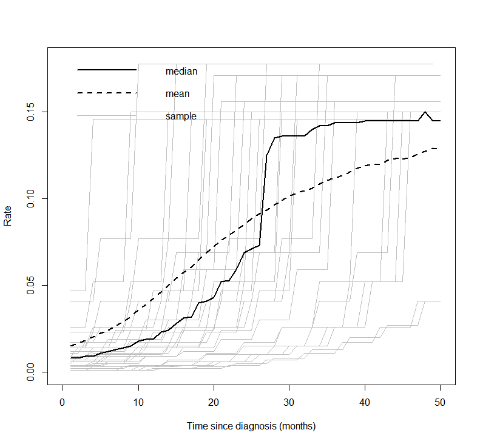

```{r, include = FALSE}
knitr::opts_chunk$set(
  collapse = TRUE,
  comment = "#>"
)
```

### Jointly distributed PFS and OS event times, distributional background

We see that the expected OS survival curves are biased; over-estimating
the rate. This is not the case for the *ipilimumab*. This is due to the
additional joint component in the OS linear regression. This may be due
to censoring since *ipilimumab* has the smallest amount. This is an area
for research.

However, the model does fit well taking in to account the case-mix of
the study population. The posterior prediction plots show that the
Kaplan-Meier for the observed data lies within the simulated curves.

```{r fig.show='hold',fig.align='center', out.width="40%", echo=FALSE}
knitr::include_graphics(c("../plots/S_plots_exp_exp_cf_separate_IPI_joint.png", "../plots/post_pred_joint_cf separate_exp_exp_IPILIMUMAB.png"))
```

```{r fig.show='hold', fig.align='center', out.width="40%", echo=FALSE}
knitr::include_graphics(c("../plots/S_plots_exp_exp_cf_separate_NIVO_joint.png",
                          "../plots/post_pred_joint_cf separate_exp_exp_NIVOLUMAB.png"))
```

```{r fig.show='hold',fig.align='center', out.width="40%", echo=FALSE}
knitr::include_graphics(c("../plots/S_plots_exp_exp_cf_separate_NIVO+IPI_joint.png", "../plots/post_pred_joint_cf separate_exp_exp_NIVOLUMAB+IPILIMUMAB.png"))
```

#### Survival distribution informed by the WHO data

However, we also want the developed model to be able to be applied to
other data sets which may be smaller or noisy. Also the mortality rate
for the cured study population may not be the same as the general
population. Sensible prior parameter values can be taken for the life
table hazard curve. After infancy the log-hazard is approximately linear
and so intercept and slope estimates are simple to obtain.

In this analysis we use the more general distributional approach. This
allows for more freedom in the model fitting.

## Jointly distributed event times model

One effective way of modelling joint (bivariate) distributions is to
factorise them into a marginal and a conditional distribution (which
holds as a fundamental rule of probability). In general terms, we can
then write $p(x,y) = p(x)p(y | x)$. In the context of our model, we can
use this intuition to model the joint distribution of the PFS and OS
observed times (in terms of their survival curves) as: $$
S(t_{OS},t_{PFS}) = P⁡(T_{OS} \geq t_{OS}, T_{PFS} \geq t_{PFS})
= S_{PFS} (t_{PFS}) S_{OS|PFS}(t_{OS}│T_{PFS} = t_{PFS}).
$$ The structure above implies that essentially we first create a
marginal generalised linear regression to model the survival curve for
the PFS data (as a function of relevant covariates); the second module
of the model implies another generalised linear regression for the OS
data, where the observed PFS data act as a covariate (in addition to
other relevant predictors, which may or may not be the same used for the
PFS model). Alternative specifications are possible (for instance, the
generalised linear model can be applied on the scale of the hazard
function, if more appropriate). This modelling approach can be
visualised in the graph below.

{width="80%"}

If we factorise into marginal and conditional components to model the
underlying bivariate distribution this can be written generally as

$$
OS_i \sim p(c | PFS, \phi_{iOS}, \tau_{OS})
$$ $$
g_{OS}(\phi_{iOS}) = \beta_0 + \beta_1 (PFS_i - \mu_{PFS})[+ \ldots]
$$ $$
\mu_{OS} = g_{OS}^{-1}(\beta_0)
$$ $$
g_{PFS}(\phi_{iPFS}) = \alpha_0 [+ \ldots]
$$ $$
PFS_i \sim p(PFS | \phi_{iPFS}, \tau_{PFS})
$$ $$
\mu_{PFS} = g_{PFS}^{-1}(\alpha_0)
$$

The combined log-likelihood is $$
\mathcal{l} = \mathcal{l}_{OS} + \mathcal{l}_{PFS}
$$

For the case with exponential OS times and exponential PFS times with
centred age this gives the following.

$$
t_{iOS} \sim Exp(\phi_{iOS})
$$ $$
\log(\phi_{iOS}) = \beta_0 + \beta_1 (t_{iPFS} - \bar{t}_{PFS}) + \beta_2 age_{iPFS}
$$ $$
\mu_{OS} = \exp(\beta_0)
$$ $$
\log(\phi_{iPFS}) = \alpha_0 + \alpha_1 age_{iOS}
$$ $$
t_{iPFS} \sim Exp(\phi_{iPFS})
$$ $$
\mu_{PFS} = \exp(\alpha_0)
$$ $$
\bar{t}_{PFS} = 1/\mu_{PFS} 
$$

Where $\bar{t}_{PFS}$ is the mean time to event for PFS. This is simple
to calculate for the Exponential distribution but is more complicated
for other survival distributions. The parameters $\phi_{iOS}$ and
$\phi_{iPFS}$ are the uncured hazard rates for individual $i$ for OS and
PFS, respectively.

The background hazard rates are specified as follows

$$
t_{iOS} \sim Exp(\phi^*_{iOS})
$$ $$
\log(\phi^*_{iOS}) = \beta_0^* + \beta^*_1 age_{iOS}
$$ $$
t_{iPFS} \sim Exp(\phi^*_{iPFS})
$$ $$
\log(\phi^*_{iPFS}) = \beta_0^* + \beta^*_1 age_{iPFS}
$$ Notice that the coefficients $\beta_0^*$ and $\beta^*_1$ are the same
in both equations.

### Independent PFS and OS event times, distributional background

#### Pooled cure fraction

This is the most restrictive model and so as we would expect it gives
the worse results. The OS appears better than the PFS plots; the PFS
CrIs fail to contain the observed data.

```{r fig.show='hold',fig.align='center', out.width="40%", echo=FALSE}
knitr::include_graphics(c("../plots/S_plots_exp_exp_cf_pooled_IPI.png", "../plots/post_pred_cf pooled_exp_exp_IPILIMUMAB.png"))
```

```{r fig.show='hold',fig.align='center', out.width="40%", echo=FALSE}
knitr::include_graphics(c("../plots/S_plots_exp_exp_cf_pooled_NIVO.png", "../plots/post_pred_cf pooled_exp_exp_NIVOLUMAB.png"))
```

```{r fig.show='hold',fig.align='center', out.width="40%", echo=FALSE}
knitr::include_graphics(c("../plots/S_plots_exp_exp_cf_pooled_NIVO+IPI.png", "../plots/post_pred_cf pooled_exp_exp_NIVOLUMAB+IPILIMUMAB.png"))
```

#### Separate cure fraction

The models with independently fit cure fraction appear to fit reasonably
well. The mismatch in fit is due to the assumption of an exponential
survival curve for uncured patients which does not capture the true
curvature.

```{r fig.show='hold',fig.align='center', out.width="40%", echo=FALSE}
knitr::include_graphics(c("../plots/S_plots_exp_exp_cf_separate_IPI.png", "../plots/post_pred_cfsep_exp_exp_IPILIMUMAB.png"))
```

```{r fig.show='hold',fig.align='center', out.width="40%", echo=FALSE}
knitr::include_graphics(c("../plots/S_plots_exp_exp_cf_separate_NIVO.png", "../plots/post_pred_cfsep_exp_exp_NIVOLUMAB.png"))
```

```{r fig.show='hold',fig.align='center', out.width="40%", echo=FALSE}
knitr::include_graphics(c("../plots/S_plots_exp_exp_cf_separate_NIVO+IPI.png", "../plots/post_pred_cfsep_exp_exp_NIVOLUMAB+IPILIMUMAB.png"))
```


The table below summarises the cure fraction posterior distribution for
each scenario.

| | Event times | Cure fraction | Treatment | $cf_{OS}$ (CrI)   | $cf_{PFS}$ (CrI)  | $\beta_{joint}$ (CrI)  |
|-|------------:|--------------:|----------:|------------------:|------------------:|-----------------------:|
|1| Independent | Pooled        | IPI       | 0.14 (0.12, 0.18) | 0.14 (0.12, 0.18) |                        |
|2| Independent | Pooled        | NIVO      | 0.36 (0.33, 0.41) | 0.36 (0.33, 0.41) |                        |
|3| Independent | Pooled        | NIVO+IPI  | 0.44 (0.4, 0.48)  | 0.44 (0.4, 0.48)  |                        |
|4| Independent | Separate      | IPI       | 0.27 (0.19, 0.38) | 0.14 (0.1, 0.18)  |                        |
|5| Independent | Separate      | NIVO      | 0.42 (0.37, 0.47) | 0.32 (0.27, 0.36) |                        |
|6| Independent | Separate      | NIVO+IPI  | 0.5 (0.45, 0.55)  | 0.38 (0.33, 0.43) |                        |
|7| Joint       | Separate      | IPI       | 0.18 (0.12, 0.24) | 0.14 (0.11, 0.19) | -0.286 (-0.489, -0.155)|
|8| Joint       | Separate      | NIVO      | 0.16 (0.1, 0.2)   | 0.31 (0.26, 0.36) | -0.125 (-0.17, -0.094) |
|9| Joint       | Separate      | NIVO+IPI  | 0.22 (0.17, 0.27) | 0.38 (0.33, 0.43) | -0.145 (-0.212, -0.099)|


Leave-one-out cross validation


|Model |Statistic | Estimate | SE  |
|-----:|---------:|---------:|----:|
|   4  | elpd_waic| -1834.3  | 35.6|
|   5  |          | -1666.8  | 46.2|
|   6  |          | -1538.5  | 54.3|
|   4  | p_waic   | 7.1      | 0.8 |
|   5  |          | 8.4      | 0.8 |
|   6  |          | 9.6      | 1.4 |
|   4  | waic     | 3668.6   | 71.2|
|   5  |          | 3333.6   | 92.4|
|   6  |          | 3077.1   |108.6|


## Future work

#### Expand available distributions

Having shown the application of these methods to this problem we will
extend the tool kit to include other standard parametric distributions
are tested:

-   Weibull
-   Gompertz
-   Log-normal
-   Log-logistic
-   Generalised gamma

#### Sensitivity analysis

Of course, when the data offer only limited amount of information, the
assumptions in the prior distribution possibly exert much influence on
the results - and crucially on the decision model output. We will
conduct extensive sensitivity analysis and will justify assumptions in
all aspects of the modelling strategy by assessing the meaning of the
various distributional assumptions visually and formally.

#### Model checking and testing

We have already written a suite of simulation functions to create
synthetic cohorts with which to test the models such that we know the
true underlying data generating process.

#### Background survival

An alternative non-parametric approach, as used in @Demiris2006, is to
use a *Gamma process* to define gamma distributions at each time. A
variance parameter determines the influence between times.

Average values derived from the life tables are used in the Gamma
process. These are age-sex-country standardised. The below plot shows
the mean, median and a sample of hazard curves for the checkmate data
set. The underlying hazard curve for 0-100 year olds is shifted left
depending on the starting age of an individual in the cohort.

```{r, echo=FALSE, fig.align='center', out.width="60%"}

```

#### Additional model structure

The two regression models can be extended to more complex structures,
for instance by including a mixture model in one or both (and eventually
by including some further correlation structure in the mixing
parameters).

For this analysis it was unnecessary but we may generalise the model so
that the cure fraction is dependent on covariates. Therefore, the
posterior with $\beta^{cf}$ representing the coefficients of the cure
fraction regression is

$$
p(\boldsymbol{\beta^u},\boldsymbol{\beta^*}, \boldsymbol{\beta^{cf}} | \boldsymbol{\delta}, \boldsymbol{x}) \propto L(\boldsymbol{\beta^u},\boldsymbol{\beta^*}, \boldsymbol{\beta^{cf}} | \boldsymbol{\delta}, \boldsymbol{x}) g_1(\boldsymbol{\beta^{cf}})  g_2(\boldsymbol{\beta^u}) g_3(\boldsymbol{\beta^*})
$$
